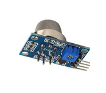

[//]: # (vlug knippen en plakken voor het schrijven tekst blokken 

)

#Inhoudsopgave

# Figurenlijst

#Abstract
Het pilootproject van het automatisch vergaderzaalbeheer in Exchange server 2016 met een Raspbery Pi 3B en een PIR-STD sensor is stapsgewijs tot stand gekomen. Dit is het eerste Internet of Things hardware project bij Digipolis Antwerpen dat intern werd ontwikkeld. Hiervoor is het project gestart met een betaalbare technologie en een simpele autonomie, zoals de Arduino Uno microcontroller en een Passive Infrared Sensor (PIR) om activiteit in een vergaderzaal te detecteren. Naarmate het project vorderde is het project geëvolueerd naar het gebruik van meer intelligente hardware, zoals de Rasberry PI 3B, om aan de projecteisen te voldoen. Zo heeft de Raspberry Pi 3B een ingebouwde ethernet poort, wifi en Bluetooth om de het project van de nodige connectiviteit te voorzien. Op de Raspberry Pi 3B draait het Linux Raspbian operating systeem met een python3 script om de sensors uit te lezen. De hardware werd verder uitgebreid met een PIR-STD-LP sensor en een Led. De software werd aangevuld met een RabbitMQ MQTT Broker die bij NSX Normalized Systems wordt gehost. De hard- en software zijn in staat om in eerste instantie bewegingen te detecteren wat de aanwezigheid van mensen verondersteld. In de toekomst kan er een DHT22 of MQ-135 sensor worden toegevoegd. De DHT22 sensor kan de temperatuur alsook de vochtigheidsgraad meten terwijl de MQ-135 veel voorkomende (giftige) gassen kan opsporen. Deze sensoren zullen later in de scriptie nader beken worden. De software die deze gegevens interpreteren zullen de dataset verrijken in de toekomst. Tijdens deze fase van het project worden de technieken (zowel hardware als software) bestudeerd, geëvalueerd en bijgestuurd met de resultaten van de uitgevoerde testen. Op die manier wordt het proces steeds verfijnd en worden werkende deelprojecten gerealiseerd.
#Dankwoord
Nog te schrijven.
# Introductie 
#Introductie
In deze bachelorproef wordt onderzocht wat het Internet of Things kan betekenen voor Digipolis Antwerpen met als doel de gebouwen van Digipolis Antwerpen verder te laten evolueren in het digitale tijdperk. Het Internet of Things is de ontwikkeling van het internet; alledaagse voorwerpen kunnen zo  gegevens met elkaar uitwisselen doordat ze met elkaar verbonden zijn via een netwerk. Deze technologische ontwikkeling drukken zich de dag van vandaag uit in een slimme stad ofwel “Smart City”. Door informatietechnologie optimaal te gebruiken, kan het besturen en beheren van een stad veel efficiënter gebeuren. Dit gebeurt door het efficiënt integreren van fysieke, digitale en menselijke interactiesystemen in de omgeving van gebouwen (Smartbuildings) om de levenskwaliteit naar de toekomst toe te verhogen. In deze scriptie wordt beschreven hoe “Smartbuildings @ Digipolis: De bezettingsgraad van conferentie ruimtes optimaliseren” tot uiting is gekomen.
##Digipolis Antwerpen
Digipolis Antwerpen wil zijn doorgedreven digitalisering en de daarbij horende stabiliteit ook in eigen huis verder ontwikkelen en gestalte geven. Dit wil zeggen dat de afdeling Digipolis Antwerpen zijn ruimtes optimaal wil benutten. Meer nog, zij willen via een digitaal platform alle bevoegde instanties en medewerkers informeren over hun intern gebruik van alle accommodatie en multimedia in het gebouw.
##Onderzoeksvraag van het project
De onderzoeksvraag bij Digipolis Antwerpen: Wat zijn de mogelijkheden met Internet of Things om het Digipolis-gebouw verder te laten evolueren in de wereld van Smartbuildings? Tijdens de eerste weken van de stage is er onderzocht wat project hiervoor het meest in aanmerking zou komen. Voordat het project van “Smartbuildings @ Digipolis: De bezettingsgraad van conferentie ruimtes optimaliseren” werd gekozen is er een voorafgaand onderzoek gebeurd. De beschikbare projecten bestonden uit:
* Zoek een nuttige toepassing voor de Sigfox QW Developerskit.
* Zoek een methode voor een accurate telling van mensen in het gebouw om een evacuatie zo vlot mogelijk te laten verlopen.
* Zoek een methode om in real-time de luchtkwaliteit in het gebouw te analyseren.
* De bezettingsgraad van conferentie ruimtes optimaliseren.
Deze projecten worden nader bekeken en geëvalueerd om later in de praktijk te worden omgezet. Belangrijke aspecten om als kandidaat project geselecteerd te worden moet het project voldoen aan de privacy wetgeving en kunnen functioneren binnen de beveilingsvereisten van Digipolis Antwerpen. Het project van deze scriptie is een hardware pilootproject binnen Digipolis Antwerpen, daarom is het budget en de beperkingen voor het project niet bekend. Deze beperkingen worden tijdens het onderzoek en het ontwikkelingsproces vastgelegd op basis van de bevindingen. De bevindingen moeten in kaart brengen wat al dan niet mogelijk is binnen het beleid van Digipois Antwerpen. Het is belangrijk hier rekening word gehouden met de aspecten van de privacy wetgeving, de kosten van het project en de in huis bronnen om het project naar de toekomst toe verder te ontwikkelen. Dit laat Digipolis Antwerpen toe om in de toekomst een beter inzage te geven in de praktische uitwerking van Internet of Things projecten binnen Digipolis Antwerpen zelf.

##Selectie van het project en probleemstelling
###Sigfox QW Developerskit
Digipolis Antwerpen is al enige tijd bezig zich te verdiepen in de wereld van Internet of Things. Al voor de stage begon heeft Digipolis Antwerpen een QW Development Kit ter beschikking gekregen om zo te onderzoeken wat Sigfox voor Digipolis Antwrpen kan betekenen. Omdat Digipolis geen interne ontwikkelaars heeft die zich specialiseren in Internet of Things, is de Sigfox QW module al enige tijd blijven liggen. Hieruit vloeide de vraag om een nuttige toepassing voor de Sigfox QW module te vinden en te achterhalen of dit een haalbaar project is voor deze scriptie.
De eerste vraag die Digipolis Antwerpen stelt is: “Wat is de QW Development Kit en wat zijn de capaciteiten van de ervan?” De QW Development Kit is een standalone Mbed prototype board dat gebaseerd is op het Arduino platform. Dit platform is programmeerbaar via de Arduino IDE of door het gebruikt van AT (Hayes) commando’s. Het prototype board dat gebaseerd is op het NUCLEO-L152RE board heeft naast een ISM 868MHz Sigfox Low power Wide area network (LPWAN) modem (op basis van een TD1204 modem) nog een hele waaien aan sensoren ter beschikking zoals een accelerometer, actieve GPS antenne, licht gevoelige sensor (VCNL4010), proximity en analoge temperatuur sensors (MCP9700). Verder beschikt de module over 26 digitale en 9 analoge poorten die kunnen gebruikt worden om het systeem nog verder uit te werken. Het QW Development Kit kan functioneren op 2.3 Volt tot 3.6 Volt stroombron waardoor deze module geheel mobiel kan gebruikt worden om sensordata te verzamelen en deze te verzenden. Sigfox laat toe om 140 berichten van 12 Bytes (exclusief transmissie en header informatie) berichten te verzenden (uplink) en 4 berichten van 8 Bytes per dag te ontvangen (donwlink).
De tweede vraag van Digipolis Antwerpen is: “Wat kunnen we met deze module doen?” Indien nodig, rijdt er een interne koerierdienst van Digipolis Antwerpen naar andere hoofdlocaties van de stad zoals de Bel-toren en Perméke-bibliotheek. Om deze koerierdienst beter op te volgen kan de Sigfox module in de koerier zijn auto geïntegreerd worden. Zo kan de locatie van de koerierdienst op afstand gevolgd worden en een mogelijk digitaal manifest van de lading bij punt A worden geüpload en bij punt B worden gedownload. Zo kan de administratie en inventarisatie vlotter verlopen van goederen die tussen de Digipolis locaties verdeeld worden.
Om het project tot zijn recht te laten komen, zou het nodig zijn om de juiste beveiligings- en overheidsprotocollen, verzekeringen en een budget voor het installeren van de hardware in de koerierwagen moeten worden aangevraagd. Het was moeilijk in te schatten of dit allemaal in orde zou kunnen gebracht worden gedurende de stageperiode. Dit project was spijtig genoeg niet haalbaar voor deze scriptie.
###De accurate telling van mensen in het gebouw tijdens een evacuatie.
In de gebouwen van Digipolis zijn dagelijks een duizendtal mensen aanwezig. In geval van evacuatie wordt er via de intercom een boodschap afgeroepen. Het is echter heel moeilijk om te achterhalen of iedereen daadwerkelijk het gebouw heeft verlaten. Nadat de boodschap tot evacuatie is afgeroepen, moet de verdiepingverantwoordelijke voor zover mogelijk, zijn verdieping controleren om te voorkomen dat er iemand achterblijft. Dit is een tijdrovende opgaven waardoor bij brand of rookontwikkeling de verantwoordelijke zichzelf in gevaar kan brengen. Digipolis Antwerpen vroeg zich af wat Internet of Things hierin voor hen kon betekenen.
Een belangrijk aspect echter was dat de systemen die het aantal mensen tellen of detecteren geen nadruk mag nalaten in het dagelijks leven van de werknemer of de bezoekers van Digipolis Antwerpen, immers zij dienen te voldoen aan de strengste vereisten van de Privacywet (GDPR). Optische sensoren zoals camera’s of het verzamelen van biometrische gegevens is een zeer gevoelige kwestie in verband met de GDPR. Tijdens het onderzoek naar de mogelijkheden voor dit project zijn een groot aantal system beken waaronder Infrarood sensors die mensen konden tellen, intelligente drukgevoelige matten, ultrasone sensors, een mobiele RFID badgescanners en een automatisch bericht dat weergeven wordt op alle actieve pc's die aanwezig zijn in het complex, maakte in grote mate deel uit van het onderzoek.
Een autonoom passieve infrarood sensor (PIR) netwerk op batterijen die per verdieping is geïnstalleerd en zo een hele verdieping in het oog kan houden, zou één van de minst indringende oplossingen zijn. Dan hoeft de verdiepingverantwoordelijke enkel nog de toiletten te controleren alvorens zelf het gebouw te verlaten. Uit het onderzoeken naar de haalbaarheid van dit project voor de scriptie is gebleken dat hiervoor toch heel wat toestemmingen nodig zijn voor het implementeren van het systeem. Bij nood kan de stroomvoorzieningen van het gebouw uitgeschakeld worden en zou het detectiesysteem een eigen stroombron voorziening moeten hebben. Voor het plaatsen van lithium batterijen in de infrastructuur van overheidsgebouwen was een hogere beveiligingstoestemming nodig om dit project te kunnen realiseren. Bovendien moest dit ook allemaal protocollair-gewijs aangevraagd worden bij o.a. de veiligheidscommissie. Daarnaast moet ook het budgettaire aspect om de hardware aan te kopen en te testen in rekening worden genomen, wat veel tijd in beslag zou nemen. Digipolis Antwerpen wenst te investeren in een waterdicht systeem dat op basis van passieve systemen die onopgemerkt blijven voor de bezoeker of werknemer en geen gebruiker handelingen vereisen wat moeilijk haalbaar is binnen de korte periode van de stage. Hierdoor werd dit project na enkele weken jammer genoeg niet verder uitgewerkt.
###Opvolgen van de luchtkwaliteit in het gebouw in real-time.
Digipolis Antwerpen bestaat uit 2 grote gebouwen met elk 6 verdiepingen. Beide gebouwen bestaan uit vaste ramen die niet opengezet kunnen worden. Daarom is heel het gebouw voorzien en afhankelijk van een airconditioning systeem dat er voor de nodige luchtcirculatie zorgt. Digipolis Antwerpen had de vraag of het via Internet of Things mogelijk was om de luchtsamenstelling in heel het gebouw in kaart te brengen. Tijdens het onderzoek is er gekeken naar een Arduino en Raspberry Pi gekoppeld aan sensoren zoals MQ-135 gas sensor die die veelvoorkomende gassen detecteert die de luchtkwaliteit in het dagelijkse leven bepalen. Deze sensor werkt op 5 Volt en is compatibel met een hele reeks microcontrollers. Deze sensor uit de MQ familie detecteert gassen zoals:
* Alcohol of ook voorkomend in de vorm zoals ethanol (C2H5OH) kan terug gevonden worden in bijvoorbeeld schoonmaak producten, verf en verf verwijderaars. Lange blootstelling aan deze stof kan bij sommige mensen duizelingen en misselijkheid veroorzaken.
* Ammoniak (NH3) is een verbinding tussen waterstof en stikstof. Op kamer temperatuur is deze giftig, kleurloos en brandbaar met een specifieke prikkelende geur die door alle mensen word uitgeademd en zich kan opstapelen in slechte verluchte gebouwen.
* Benzeen is een organische verbinding die bijvoorbeeld vrijkomt bij tabaksrook en uitlaatgassen. Bij kamertemperatuur bestaat benzeen uit een kleurloze vloeistof met onaangename geur. In een sigaret zit tussen de 0.01-0.05mg benzeen. Deze stof beschadigt DNA en kan op lange termijn kanker zoals benzeen leukemie veroorzaken.
* Koolstofdioxide (CO2) is een anorganische verbinding van zuurstof en koolstof. Dit is een geurloze en kleurloos gas dat samen met waterdamp koolzuurgas vormt. In hogere concentraties is koolstofdioxide giftig.
* Stikstofoxiden (Nox) is een verzamel naam voor stikstof en zuurstof. Dit is een bijproduct als er op hoge temperaturen verbrandingen gebeuren. 
Bij nader onderzoek van dit project bleek dat het implementeren van deze sensor in het huidige ventilatiesysteem niet praktisch was omdat veel interne systemen afhangen van externe onderhoudscontracten. Het aanvragen van de nodige permissies en integratie in het bestaande systeem zou teveel tijd met zich meebrengen om deze voor een scriptie te gebruiken. Hierdoor kwam het project van luchtkwaliteit ook niet in aanmerking voor deze scriptie.
###De bezettingsgraad van conferentie ruimtes optimaliseren
Bij Digipolis Antwerpen is het mogelijk voor zowel Digipolieten om de vergaderruimte te reserveren als voor scholen, politie en andere organisaties om een vergaderruimte te huren aan 3€ per persoon. De vraag naar vergaderruimtes is hoog en het aantal vergaderplaatsen echter beperkt. Een voorkomend probleem is dat een vergadering niet plaats vindt of vroegtijdig gedaan is zonder dat de reservering geannuleerd wordt. Om dit te voorkomen en het plaatstekort aan vergaderzalen het hoofd de bieden, heeft Digipolis Antwerpen de vraag gesteld of Internet of Things ervoor kan zorgen dat de beschikbare conferentieruimtes optimaal benut worden?
Door het toepassen van de actuele mogelijkheden beschikbaar zijn in de wereld van Internet of Things is het haalbaar om vergaderzalen automatisch te beheren door de inzet van sensors. Door het implementeren van verschillende sensoren die informatie vergaren, zou de beschikbaarheid van vergaderzalen in kaart gebracht moeten kunnen worden. De verzamelde gegevens zouden na verloop van tijd geanalyseerd worden waarbij de mogelijkheid verkregen wordt om het toekomstige gebruik van de vergaderzalen te kunnen voorspellen en te optimaliseren. In eerste instantie moet er uitgezocht worden wat voor technologie gebruikt zou kunnen worden om zo rendabel mogelijk een prototype te ontwerpen. Hierbij was het ook van belang dat de werking van dit systeem voldoet aan de verschillende regelgevingen en protocollen waaraan moet worden voldaan. Langzamerhand werd het nogmaals duidelijk dat budgettaire- en beveiligingsprocedures het project zullen beïnvloeden en het realiseren van het project niet vergemakkelijken.
Het onderzoeken van de mogelijkheden en beperkingen, rekening houdend met de privacy wetgeving (GDPR), nam zoals steeds veel tijd in beslag. In het verloop van het onderzoek zijn een aantal technologieën die in aanmerking kwamen voor het project getest. Een aantal van deze technologieën die heel interessant zijn voor dit project zijn geschrapt omdat de data zich niet buiten het intranet mag verplaatsen of dat de technologie een beveiligingsrisico voor het gehele netwerk vormde.  
Ondanks deze vooruitzichten is dit pilootproject het meest haalbare zowel qua tijd als budget. Tot op heden is er in Digipolis Antwerpen intern hiervoor nog geen infrastructuur aanwezig. Dit maakte van het pilootproject een uitstekende uitdaging voor een scriptie.
@
#Techinsh
##Analyse
In het begin van de stage werd er gekeken naar wat mogelijk is voor de stage opdracht en hoe deze aan te pakken. Ook werden optionele paden overwogen om de stage opdracht aan te vullen met andere projecten waar het Internet of Things konden toegepast worden zoals het evacuatieplan. Deze bachelor proef zou een pilootproject worden binnen Digipolis Antwerpen. Voorgaand hebben zich geen interne hardware projecten binnen Digipolis plaatsgevonden. Voor dit pilootproject was nog geen omkadering bekend en stond ook nog geen budget vast. Om deze omkadering uit te stippelen is er gekozen om van het begin met simpele technologie te beginnen en zo stapsgewijs op te bouwen naar meer intelligente hardware om de beperkingen en complexiteit binnen Digipolis Antwerpen voor een hardware project in kaart te brengen. Het gekozen pilootproject om de bezettingsgraad van vergaderzalen te optimaliseren door inzet van sensors zal door drie fasen van het ontwikkeling gaan.
* De eerste fase is development waar mogelijke technologieën en potentiële hardware zal worden onderzocht om dit project tot uiting te brengen. In deze fase moeten ook de beperkingen naar boven komen van wat mogelijk is binnen de infrastructuur van Dgipolis Antwerpen waar beveiliging van het netwerk, de aanwezige data en de wet van de privacy voor personeel en bezoekers vooropstaat.
* De tweede fase is acceptatie waar de het ontwikkelde prototype en de bijhorende software zal getest worden. In deze fase moeten mogelijke veiligheidsrisico’s naar boven komen en verholpen worden. Het prototype zal ook in de praktijk getest worden in een vergaderzaal.
* In de derde en laatste fase productie zal het project verder worden uitgebreid naar meerdere vergaderzalen op voorwaarden dat zowel de hardware als de software voldoen aan de criteria en eisen die Digipolis Antwerpen stelt aan dit piloot hardware project.
###Het ontwikkelingsproces
Om dit pilootproject tot uiting te laten komen zijn een hele reeks aan technologieën overwogen voor zowel de hardware als de software. Voorheen waren er nog geen specificaties, limitatie of omkadering bekend waardoor een rode draad onbestaande was. Zodoende is dit Internet of Things pilootproject stapsgewijs opgebouwd met als startpunt een simpele microcontroller technologie zoals de Arduino UNO die later evolueerde naar een meer intelligente microcontroller zoals de Raspberry Pi 3B die een Broadcom BCM43438 2.4GHz 802.11N WiFi-chip geïntegreerd heeft om aan de draadloze netwerk beveiligingsvereisten van Digipolis te voldoen naarmate er meer duidelijkheid kwam in de omkadering van het project. Voor dit project werd er gekozen om Wifi te gebruiken in plaats van Sigfox of Lora omdat alle vergaderzalen zich binnen het gebouw van Digipolis Antwerpen bevinden en er een zeer redundant wifinetwerk beschikbaar is. Zo zijn er drie internet Free WiFi hotspots over het hele gebouw beschikbaar met hun eigen unieke naam (SSID) en drie individuele privé-netwerken die voor Digipolis zelf zijn voorbehouden.
Vanaf het begin van het pilootproject is er wekelijks een overleg met de stagepromotors van Digipolis Antwerpen georganiseerd om zo het project op te volgen en af te bakenen. Hierdoor werd er scherp gesteld wat er al dan niet mogelijk is. Zo leefde in het begin van het project nog de intentie om een PowerShell script te gebruiken waarmee via de Exchange Web Service API (EWS) de reserveringen van de vergaderzalen beheerd konden worden. Bij het gebruik van PowerShell scripts rijst de bezorgdheid om de veiligheid van het Digipolis netwerk. Hierbij stelde zich de vraag naar het verkrijgen van de execution policies nodig om een standalone script op de servers te laten lopen. Gedurende de eerste helft van de stage zijn er een heel aantal voorstellen geweest die stukje bij beetje hun bijdrage hadden om dit project vorm te geven. De voornaamste stappen zijn hieronder beschreven en de bijdrage die ze aan het project hebben geleverd in het afbakenen en het omkaderen wat voor Digipolis aanvaardbaar is om als project in de realiteit te worden omgezet.
####Arduino UNO met WizFi210 Shield en PIR Sensor
De Arduino UNO is een uitstekende kandidaat voor herhalende taken zoals het verzamelen van sensordata. Deze kleine microcontroller werkt op 5V en heeft als kern een ATmega328P chipset die de functionaliteit aan de microcontroller geeft. Arduino UNO heeft een 16MHz kloksnelheid en een 32kb flashgeheugen dat op de ATmega328P chip zit verwerkt. De Arduino UNO heeft 14 Digitale input/output pinnen waarvan 6 een PWM functionaliteit hebben. Iedere pin kan tot maximaal 20mA stroom aan. Dit is genoeg om de meeste standaardsensoren aan te sturen. Door de eenvoud van deze microcontroller zou dit een uitstekende oplossing kunnen zijn voor het project. De WizFi shield is een gemakkelijk te monteren shield op de Arduino UNO. Dit wifi prototype shield is zo opgebouwd dat deze eenvoudig te monteren is op de Arduino UNO. Zo maakt de WizFishield gebruik van een UART interface. De ESP8266 chipset die de WizFishield geintegreerd heeft ondersteund wifi standaard 802.11 b/g/n en accesspunt modus. Uit de specificatie documentatie was af te leiden dat deze module de nodige WPA2-Enterpise vereisten zou ondersteunen.
In eerste instantie lag de focus op het gebruik sensors en het aanspreken van de Exchange server. Hierbij werden Arduino UNO Rev.3 en een Passive Infrared Sensor (PIR) gebruikt om de activiteit in een vergaderzaal te detecteren. De Arduino UNO microcontroller geeft sensordata draadloos door aan een server die een PowerShell script host. Hiervoor maakt de Arduino UNO controller gebruik van een zelfstandige ESP8266 Wifimodule. De bedoeling is dat het PowerShell script controleert op de Exchange server of de vergaderzaal gereserveerd is door de Exchange Web Service API (EWS) aan te spreken. Zo vergelijkt het script de datum en tijd van de reservatie met de ontvangen sensordata. Als het script de eerste 30 minuten van de vergadering of 20 minuten nadat de vergadering is begonnen, geen activiteit detecteert in de vergaderzaal dan zal het script de reservering van de vergadering op de Exchange Server annuleren. Zo kan de vergaderzaal door iemand anders opnieuw geboekt worden. De events die het script onderneemt, zouden worden bijgehouden in een PostgreSql databank. De databank verzamelt informatie over de bezetting en de redenen waarom de reservatie van de vergaderzaal is geannuleerd. Er werd gekozen voor apparatuur op batterijen. De architectuur zou er als volgt uitzien:
Het eerste probleem dat zich voordeed bij het testen van het Arduino UNO prototype en de WizFi210 shield was de verbinding van de Arduino met het WiFi netwerk van Digipolis. Deze gebruikt WPA2-Enterprise PEAP-MSSHAPv2 encryptie. De ondersteuning van Enterprise encryptie voor Arduino UNO en de WizFisheild met de ESP8266 chipset bleek echter te beperkt te zijn. Er zou de mogelijkheid bestaan om een nieuwe firmware te installeren maar deze was betalend om de Enterprise security functionaliteit te kunnen gebruiken. Als oplossing voor dit probleem kan een Root Certificaat binair op de Arduino geplaatst worden. Daarenboven blijkt dat Arduino geen betrouwbare CA authenticatie heeft en kwetsbaar is voor “man in the middle attacks”.
Na het voorleggen van deze problemen werden de risico’s voor de beveiliging van het Digipolis-netwerk gewogen en te zwaar bevonden door de stagementors van Digipolis Antwerpen. Bijgevolg is het gebruik van een Arduino en PowerShell geschrapt voor dit project. Het gebruik van PowerShell op een apparaat dat kwetsbaar is voor netwerk intrusies en het opslaan van Binaire netwerkcertificaten is een te groot veiligheidsrisico en onaanvaardbaar voor Digipolis. Daarnaast verkiest Digipolis ook een openssource oplossing. Er zal ook geen gebruik gemaakt worden van apparaten die gevoed worden met batterijen. Bij het gebruik van batterijen moet je de goedkeuring hebben van de veiligheidscommissie. Immers, het integreren van van lithium batterijen in een gebouw is niet geheel zonder gevaar gezien Lithium ontvlambaar substantie is en aangegeven moet worden bij de brandweer. Ook het onderhoud van batterijen brengt kosten met zich mee. Om deze redenen zal er voor een testopstelling gekozen worden dat werkt op netstroom. Er wordt besloten om verder op zoek te gaan naar alternatieven waarbij het gebruik van vergaderzalen verder geoptimaliseerd kan worden.
####2.1.1.2	Arduino Featherwing HUZZAH ESP8266
Bij een volgende opstelling werd er gekozen om met een Arduino Featherwing HUZZAH te werken. De Arduino Featherwing HUZZAH is kleiner dan de Arduino UNIO en heeft een geintegreerde ESP8266 chipset.
Ook hierbij controleert een script op de Exchange server of de vergaderzaal gereserveerd is door de Exchange Web Service API (EWS) aan te spreken. 

In tegenstelling tot de eerste testopstelling werd er niet gewerkt met apparatuur gevoed door batterijen maar met apparaten die hun voeding uit netstroom halen.
Zoals eerder bleek, was de verbinding van de Arduino met het WiFi netwerk van Digipolis een obstakel. Deze gebruikt WPA2-Enterprise PEAP-MSSHAPv2 encryptie. Een Arduino Uno met externe ESP8266 wifi module, blijkt geen waardig alternatief voor de eerste gefaalde proefopstelling gezien de ondersteuning van Enterprise encryptie voor Arduino eerder beperkt is.
Tijdens het overleg bleek dat het niet eenvoudig zou zijn om een goedkeuring te krijgen voor de eigengemaakte voeding (de voeding zou via netstroom verlopen en niet via batterijen zoals in de eerste opstelling). De procedure die gevolgd moet worden is te lang en waarschijnlijk niet haalbaar in deze stageperiode. Bovendien kunnen er geen veiligheidscertificaten voorgelegd worden en ontbreken doeltreffende betrouwbaarheidstesten voor de stepdownconverter die de veiligheidsrisico’s voor Digipolis tot nul moeten reduceren.

Ook deze testopstelling krijgt een no-go. Enerzijds vergt het eigen PCB-design een lange procedure om tot een goedkeuring en een certificiëring te komen die quasi onmogelijk gerealiseerd kan worden binnen de periode van deze stage. Anderzijds blijft de externe ESP8266 WiFi module problemen genereren bij het gebruik van Enterpise level encryptie

####Raspberry Pi Zero
Gezien de eerste fase problemen gaf i.v.m. de garanties die de netwerkbeveiliging van Digipolis Antwerpen vereisen, kwam een volgende fase in zicht waarbij de inzet van meer intelligente hardware getest kon worden. Hiervoor kwam de Raspberry PI Zero en de Raspberry PI 3B in aanmerking.

Het opstellen van een volwaardige test-setup van de Raspberry PI Zero zou extra kosten met zich meebrengen. De Raspberry PI Zero heeft geen interne WiFi module wat de aankoop van een WiFi shield en extra onderdelen nodig om een prototype te bouwen zou vereisen. Een alternatief zou de Rarspberry PI Zero W kunnen zijn, maar gezien de beperkte tijd, komt deze niet meer in aanmerking. Ook de aankoop van losse onderdelen zou het project danig vertraging kunnen bezorgen gezien de aankoopprocedures de Wet op de Overheidsopdrachten moeten volgen.

Het gebruik van Raspberry PI Zero zou extra aankopen met zich meebrengen. Dit brengt de haalbaarheid in het gedrang gezien de aankoopprocedures het project kunnen vertragen gezien de wet op de overheidsopdrachten gevolgd moeten worden. Bovendien heeft de Raspberry PI Zero geen meerwaarde in vergelijking met een volwaardige Raspberry PI 3B.
Er is geen testhardware beschikbaar, de Raspberry PI Zero, WiFi shield en extra onderdelen zoals pins, usb kabel converter en leveringkosten komen moeten worden aangekocht. De prijs van dit alles komt overeen met een volwaardige Raspberry PI 3B die hiermee in zicht komt als alternatief voor de Raspberry PI Zero.
De Raspberry PI Zero blijkt te duur en het samenstellen te complex voor de noden die er leven. Digipolis heeft post stage geen interne elektronica techniekers ter beschikking om de hardware samen te stellen of te debuggen. Er wordt gekeken naar een Raspberry PI 3B als alternatief voor de Raspberry PI Zero.
####Raspberry PI 3B
De Raspberry PI 3B geeft het project meer mogelijkheden. Zo kan er gekozen worden voor een Linux of Windows IoT .NET Core besturingssysteem. De netwerkbeveiligingsstandaard is ook veel beter omdat de Raspberry PI 3B een volwaardig besturingssysteem heeft. De Raspberry PI 3B heeft zowel een draadloze Wifi als een wired Ethernet verbinding. Verder kunnen er ook meer intelligente sensors aangesproken worden zoals camera's en displays. Zo zou een camera bijvoorbeeld gebruikt kunnen worden om de zitplaatsbezetting op te volgen in de vergaderzaal. Een interactief display zou de boeking van de zaal kunnen weergeven en gebruikers de mogelijkheid geven om een vergaderzaal op locatie te boeken voor een toekomstige vergadering. Digipolis is gebonden aan een strenge wetgeving en privacy beleid. Daarom is het gebruik van een camera in dit project niet van toepassing. 
Voor het project worden er 2 identieke prototypes gebouwd. Een eerste prototype is gebaseerd op een Rasberry PI 3B die aan het 220V stroomnetwerk wordt gekoppeld. Op de Raspberry PI 3B wordt een Pythonscript gehost die de sensordata van de Passive Infrared Sensor (PIR) verzamelt. Het besturingssysteem van de Raspberry PI 3B staat nog niet vast. De verzamelde data wordt via Message Queueing Telemetry Transport (MQTT) gepubliceerd en naar de lokale netwerk server die een Web service API in een Docker omgeving host. De Raspberry PI 3B is de MQTT Publisher die de sensordata verzameld. Vervolgens ontvangt de MQTT Broker op de server de sensor telemetrie data. De Web service API vergelijkt de ontvangen sensor data van de MQTT Broker met de vergaderzaal reservering op Exchange Server. Als een vergaderzaal gereserveerd is, kan deze terug vrijgegeven worden na het vergelijken van de data wanneer er gedurende een bepaalde periode geen activiteit waargenomen werd.
Ook hier wordt er gebruik gemaakt van dezelfde condities die voorheen voor het PowerShell script werden bepaald.. De ontvangen activiteitdata wordt vergeleken met de datum en tijd van de reservering. Zo weet de Web service API of er iemand in de vergaderzaal zit. Als in het begin van een reservering of na een periode wanneer de vergadering begonnen is, er geen activiteit plaatsvindt, dan kan de Web service API de reservering annuleren. Zo kan de beschikbaarheid van de vergaderzalen meer optimaal benut worden. De Web service API bewaart alle realtime data in een .JSON file in plaats van een PostgreSql server. De .JSON file wordt opgeslagen op de lokale Digipolis S3 DataLake of verwerkt door de NSX analysedienst van Digipolis.
De sensoren kunnen aangevuld worden met andere meettoestellen of toepassingen. Tijdens de onderzoeksfase bleek dat het integreren van een microfoon voor het detecteren van geluid geen optie zou zijn. Enerzijds is de wetgeving op de privacy een beperkende factor. Anderzijds levert het slechts een beperkte winst op in de functionaliteit. Gezien de microfoon enkel gebruikt wordt om geluid te detecteren in de ruimte, zou het dezelfde functie opnemen als de PIR sensor (deze detecteert eveneens de aanwezigheid van objecten), wat geen meerwaarde levert aan het project. De PIR Sensor heeft voorrang op de microfoon gezien deze nagenoeg geen invloed heeft op de Privacywetgeving. Het initiële prototype zal zich richten tot het implementeren van enkel een PIR sensor maar zal wel de DHT22 sensor in de documentatie opnemen om de verdere evolutie van het project te ondersteunen na de stage.
####PIR-STD-LP
Voor de PIR sensor is gezocht naar een flexibele passieve infrarood sensor met een zeer laag verbruik en opties naar de toekomst toe. Bovendien kan deze sensor enkele handelingen autonoom uitvoeren zonder hulp van een extra microcontroller zoals Arduino of  Raspberry Pi.  Zo heeft de PIR-STD-LP sensor van B+B een ingebouwde lichtgevoelige weerstand (LDR) waardoor de hoeveelheid licht in een ruimte gemeten kan worden en een OUT signaal dat een power relay kan aansturen dat bijvoorbeeld het licht of andere apparatuur in de vergaderzaal kan in op uitschakelen om zo energie zuinig werkomgeving te voorzien. Het technische aspect zal later in het design gedeelte van deze scriptie nog verder besproken worden.
##Design
Uit het voorgaande onderzoek is de volgende architectuur ontstaan die hieronder is geïllustreerd. De rol van NSX Normalized Systems en de configuratie van de Exchange server worden later in de scriptie niet in detail besproken in deze scriptie. NSX is een extern bedrijf waar Digipolis mee samenwerkt en de configuratie om toegang te krijgen tot hun data is voor veiligheidsredenen beperkt beschikbaar is. De privileges tot de Exchange server configuratie vallen buiten de bevoegdheid van de scope van deze scriptie.

###Raspberry PI 3B en passieve infrarood sensor
Tijdens het onderzoek is er gekeken naar wat het beste besturingssystem is om de Raspberry PI 3B aan te sturen voor dit project. Hiervoor is Raspbian en Windows IoT nader bekeken en getest. De vraag vanuit Digipolis was om een systeem te hebben dat gemakkelijk te onderhouden is en daarenboven gemakkelijk kan worden uitgebreid naarmate het project vordert. De Raspberry PI 3B is een prachtig stukje hardware dat enorm veel mogelijkheden biedt. Als kern heeft de Raspbeerry PI 3B een System on Chip (SoC) Broadcom BCM2837 chipset met een 4xARM Cortex-A53, 1.2GHz CPU. En 1GB LPDDR2(900MHz) RAM geheugen. Naast een standaard 10/100 Ethernet verbinding heeft de Raspberry PI 3B ook een ingebouwde 2.4GHz 802.11n wifi module en een bluetooth 4.1 classic module en een heleboel aansluitmogelijkheden voor audio, video, camera’s en sensoren. Het doel van een Raspberry Pi is ook een beetje om Internet of Things toegankelijk te maken voor iedereen. Zo heeft Raspberry Pi met Raspbian besturingssysteem een basispakket Python en het programma Scratch aan boord. Dit maakt het aansturen van sensoren gemakkelijk door gebruik te maken van een Python code script met de nodige instructies. Deze Scripts zijn gemakkelijk te schrijven in Python en te code achteraf terug te lezen.
Windows IoT .NET Core is een recente speler in het Internet of Things. Omdat dit systeem onderzocht maar niet gebruikt is in het project, wordt deze maar beknopt besproken. De focus bij Windows IoT .NET Core ligt op het gebruik van Microsoft Azure IoT Hub en het gebruik van headless and headed apps die op basis van ASP.NET Core draaien in een minimale Windows Core omgeving. Het is mogelijk om andere programmeertalen te gebruiken in deze omgeving nadat de nodige componenten hiervoor geïnstalleerd zijn op het besturingssysteem. Bij het onderzoek is gebleken dat er hier en daar toch compatibiliteitsproblemen zijn bij het ontwikkelen van apps in Visual Studio als je Python wilt ontwikkelen. De bediening van Windows IoT ASP.NET Core op de Raspberry PI 3B via PowerShell of Putty maakt het gemakkelijk om het besturingssysteem aan te sturen. Het was van belang voor Digipolis dat het sensor gedeelte zo simpel mogelijk bleef, daarom werd besloten om geen volledige nieuwe app te schrijven om het systeem aan te sturen. Voorheen was ook besloten dat er geen PowerShell zou gebruikt worden om netwerkveiligheidsredenen. Om dit project en de nodige compatibiliteitsproblemen zich bleven voordoen, is er gekozen om Windows IoT .NET Core niet te gebruiken.
De Raspberry PI 3B zal aangestuurd worden door Raspbian, een Linux besturingssysteem dat de stabiliteit garandeert voor langlopende projecten en waarvan het gebruiksgemak bewezen is. De sensoren worden gecontroleerd door een Python3 script dat bij het opstarten van de Raspberry PI 3B automatisch data vergaart. Deze data wordt realtime doorgestuurd en bewaard bij de NSX RabbitMQTT Broker. Een webservice API gehost in een Docker omgeving, zal de data ophalen bij NSX middels een MQTT subscription. Door het analyseren van de data en het te vergelijken met de reservaties op de Exchange server, kan er beslist worden of de vergaderzaal effectief in gebruik is. Bij een negatief antwoord kan de vergaderzaal vrijgegeven worden voor een volgende gebruiker. Hierdoor wordt de bezettingsgraad geoptimaliseerd. 
Er is geen limitatie op het gebruik van Raspbian waardoor het project uitbreidbaarheid is naar andere zalen. De SD kaartjes met het Raspbian operating systeem zijn gemakkelijk te dupliceren en ook het python script heeft maar een minimum aan configuratie nodig. Hierdoor dient de hostname, credentials en de MQTT per Raspberry PI 3B te worden bijgewerkt. Door de hostname als referentie te gebruiken kan de Raspberry PI 3B op het netwerk terug gevonden worden zonder dat deze beïnvloedt wordt mocht er later een statisch of dynamic IP adress toegewezen worden.
Tijdens het onderzoek met Windows IoT Core zijn er toch enkele problemen aan het licht gekomen. Zo diende er onderzocht te worden wat het meest geschikte besturingssysteem zou zijn voor de Raspberry PI 3B. Al snel bleek dat Windows IoT Core de meeste complicaties met zich mee bracht. Er bleken te veel conflicten voor te doen bij het gebruik van Python scripts. Rasphian bleek een betere keuze gezien conflicten nagenoeg niet voorkomen. Een bijkomend voordeel is dat een Raspbian zeer gebruiksvriendelijk is en quasi letterlijk 'plug and play' bleek nadat de libraries geïmporteerd waren.
Bij de ontwikkeling van een ASP.NET Core webservice API in de Docker met een Windows 10 Home besturingssysteem bleek dat een Windows 10 Pro versie een absolute noodzaak is. Voor de Windows 10 Home-versie is er een Docker "legacy" Toolbox met Docker engine 1.12 beschikbaar. Echter deze ondersteunt enkel ASP.NET projecten en niet de laatste ASP.NET Core. Docker for Windows met Docker engine 1.13 of hoger, ondersteund ASP.NET Core. Het was voor dit Digipolis-project van fundamenteel belang dat ASP.NET Core gebruikt werd. Docker vereist Hyper-V en container ondersteuning die alleen in Windows 10 Pro beschikbaar is. Hiervoor was het aankopen van een Windows 10 Pro upgrade nodig.
Als basis voor de webservice API is er gebruikt gemaakt van een code template die door Digipolis is voorzien. Deze code template draagt de naam Eventhandler en is gebaseerd op een ASP.NET Core applicatie. Tijdens het testen van de Digipolis EventHandler ASP.NET Core template moest deze ook gemigreerd worden naar een nieuwe versie van Visual Studio. Het project zit nu in het stadium van integratie en ontwikkeling van de webservice API en het bouwen van de MQTT-brug tussen de Raspberry PI 3B en de webservice tamplate voor een feilloze overdracht van data. De volgende stap is het ophalen van de gegevens bij de exchange server en deze te vergelijken met de door NSX verzamelde gegevens.
Tijdens het testen is het moeilijk om de verzonden data naar NSX te verifiëren zonder toegang te hebben tot het NSX analytisch portaal. Een test-account is aangevraagd. In de huidige situatie moet bij iedere test NSX gecontacteerd worden per e-mail of telefonisch om de resultaten van de test te controleren. Dit is niet progressief en een tijdrovend proces. Voor dit project heeft het lang geduurd voordat de toestemming gekregen was om python te mogen gebruiken. De interne resources die Digipolis heeft om python op te volgen en te beheren zijn eerder beperkt. Gezien dat na het bekijken van opties zoals IoT Azure, was dit ook geen mogelijkheid omdat data lokaal dient te blijven en het gebruik van IoT Azure uitgesloten.

De PIR sensor heeft een openhoek van horizontaal +/-50° en een verticale hoek van +/-30° en kan werken op zowel 3.3V als 5V. De sensor heeft een sensor bereik van 12 meter dat kan in 4 stappen ingekort worden door een reeks soldeerpunten op de achterkant van het apparaat stapsgewijs met elkaar te verbinden. Op die manier kan de PIR sensor ingesteld worden op 4, 5, 6, 8 of 12 meter.

De bandbreedte van het signaal werkt van 0.5Hz tot 25Hz. In rust stand geeft het signaal een stroom van 40µA, bij het detecteren van activiteit loopt het signaal op tot 400µA. Omdat de sensor een kleine dimensie heeft van 25x25x20mm kan deze later gemakkelijk in een behuizing worden weggewerkt.

 

###Raspbian
###PIR-STD-LP

###NSX Normalized systems
* Wie is NSX?
* RabbitMQ MQTT Broker
###Web service-API en Exchange server 2016
###Paho (Mosquito) Client MQTT Subscriber
* Data processing
* Data logging
###Host server
* Docker
* Webserver API -ASP.NET Core
##Ontwikkelingsproces en toegepaste technologieën
###Interactie
* OSI model
* Backend
###Hardware
* Raspberry PI 3B
* PIR-STD
* LED
###Software
* Raspbian
* Python3
* Docker
* Webservice API ASP.NET Core
* Front end
###Externe services
* NSX
* Backend Datastorage
#Besluit
##Resultaat
###Raspberry Pi 3B en Python3
###NSX
###Web service API en Exchange server 2016
###De toekomst van het project
* Feature DHT22
* Feature MQ-135
##Samenvatting
#Bibliografie
#Bibliografie
##Gevolgde cursussen
##Geraadpleegde bronnen
###Online bronnen
###Gepubliceerde papers
#Glossary
