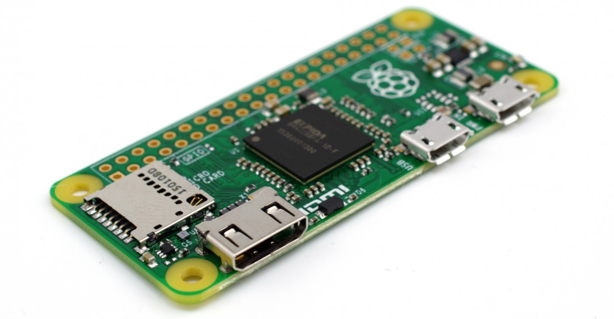

[//]: # (vlug knippen en plakken voor het schrijven tekst blokken 

)

# IoT-Smartbuildings: De bezettingsgraad van conferentieruimtes optimaliseren bij Digipolis Antwerpen

# Inhoudsopgave
* [Figurenlijst](part1/README.md)
* [Abstract](part2/README.md)
* [Dankwoord](part2/README.md)
* [Introductie](part2/README.md)
	* [Context / situering](part2/feedback_please.md)
   	* [Beschrijving stageplaats](part2/better_tools.md)
	* [Probleemstelling / opgaven](part2better_tools.md)
* [Technisch](part2/README.md)
	* [Use-Case](part2/feedback_please.md)
   	* [Beschrijving gevolgde ontwikkelproces](part2/better_tools.md)
	   	* [Project evolutie](part2/better_tools.md)
	   	* [Project parameters (limitaties)](part2/better_tools.md)	
   	* [Analyse & requirements](part2/better_tools.md)
	   	* [Hardware](part2/better_tools.md)
			* [Technische schema's & Frizzting](part2/better_tools.md)
		   	* [Arduino UNO & PIR](part2/better_tools.md)
		   	* [Arduino UNO - WizzFi shield & PIR](part2/better_tools.md)
		   	* [Arduino Featherwing HUZZAH & PIR](part2/better_tools.md)
		   	* [Arduino ESP8236 & PIR](part2/better_tools.md)
		   	* [PCB Design](part2/better_tools.md)
		   	* [Raspberry Pi Zero é PIR](part2/better_tools.md)
		   	* [Raspberry PI 3B](part2/better_tools.md)
		   	* [Exchange server 2016](part2/better_tools.md)
		   	* [Web-Service host docker op rancher](part2/better_tools.md)
	   	* [Software](part2/better_tools.md)
			* [Architecture](part2/better_tools.md)
			* [Flowchart](part2/better_tools.md)
			* [Arduino IDE](part2/better_tools.md)
			* [Rasbian](part2/better_tools.md)
			* [Windows IoT .NET Core](part2/better_tools.md)
	   	* [Integratie](part2/better_tools.md)
			* [RJ-45 Ethernetkabel](part2/better_tools.md)			
			* [Meshnetwerk](part2/better_tools.md)
			* [Ad-hock](part2/better_tools.md)
			* [WPA2 - CCMP - ESS- PEAP - MSCHAPV2 Enterprise](part2/better_tools.md)
			* [WPA2 - CCMP - ESS](part2/better_tools.md)
	   	* [Besluit (Specificaties)](part2/better_tools.md)
   	* [Roadmap](part2/better_tools.md)
   	* [Design](part2/better_tools.md)
	   	* [Hardware](part2/better_tools.md)
			* [Firmware](part2/better_tools.md)
			* [Software / Script](part2/better_tools.md)
	   	* [Software](part2/better_tools.md)
			* [Sensor Manager/web service proxy/Exchange server](part2/better_tools.md)
	   	* [Connectiviteit](part2/better_tools.md)
			* [WPA2 - CCMP - AES](part2/better_tools.md)
			* [RJ45 Ethernet](part2/better_tools.md)
   	* [Testing & validatie](part2/better_tools.md)
	   	* [Hardware Rasberry Pi 3B & PIR](part2/better_tools.md)
	   	* [Software Windows IoT .NET Core](part2/better_tools.md)
   	* [Gebruikte tools & technologieën](part2/better_tools.md)
	   	* [Docker](part2/better_tools.md)
	   	* [Bamboo](part2/better_tools.md)
	   	* [Bitbucket](part2/better_tools.md)
	   	* [Bamboo deployment](part2/better_tools.md)
	   	* [VS2015 - Web service API - Yoemen](part2/better_tools.md)
	   	* [Microsoft Windows IoT Core](part2/better_tools.md)
	   	* [Rassbian](part2/better_tools.md)
	   	* [Exchange Web Services (EWS)](part2/better_tools.md)
	   	* [Advanced Messaging Queue Protocol (AMQP)](part2/better_tools.md)
* [Conclusie & samenvatting](part2/README.md)
	* [Planning](part2/feedback_please.md)
	* [Bereikt](part2/feedback_please.md)
	* [Toekomst](part2/feedback_please.md)
* [Uitbereiding & futurework](part2/README.md)
	* [Scaling van het concept](part2/feedback_please.md)
* [Appendices](part2/README.md)
* [Bibliografie / geraadpleegde bronnen](part2/README.md)
* [Glossary](part2/README.md)

# Figurenlijst

# Abstract

# Dankwoord

# Introductie 
## Context / situering

Digipolis is een opdrachthoudende vereniging die in 2003 werd opgericht. De organisatie ligt in het verlengde van de Antwerpse en Gentse overheden en heeft bevoegdheden op het vlak van ICT. Digipolis treedt op als IT broker voor de steden Gent en Antwerpen. Gezien ze ingebed is in en een werking heeft uitgebouwd in de schoot van lokale overheden, is ook Digipolis net zoals elke andere (lokale) overheid gebonden door onder andere de wet op overheidsopdrachten voor de aankoop van werken, leveringen en diensten. Deze wetgeving heeft belangrijke invloeden op de werking van de organisatie en maakt dat de administratie traag en met veel overhead verloopt.

In de IT-wereld is er slechts één constante en wel dat alles continu in verandering is tegen een ongelooflijk snel tempo. Digipolis gaat de uitdaging aan om deze snelle evolutie bij te blijven en tegelijkertijd te zorgen voor stabiliteit. Bijkomend ontplooit de organisatie een werking conform de regelgeving die specifiek van toepassing is voor openbare besturen bovenop de reglementeringen die door ieder andere organisatie nageleefd moeten worden. Digipolis staat steeds paraat om de inwoners en medewerkers van Antwerpen en Gent zo goed mogelijk te bedienen.  
@ Referentie directeur Digipolis 2014-2015

Specifiek voor Digipolis Antwerpen werden er bijzondere opdrachten geformuleerd die welbepaalde noden dienen op te lossen. Digipolis en de stad Antwerpen kregen zo onder andere de opdracht om zich samen als Smart City te ontwikkelen. Concreet betekent dit dat men een doorgedreven digitalisering van hun werking en dienstverlening verwacht. De stad Antwerpen zet daarbij in op vijf thema's en zet mobiliteit, veiligheid, efficiënt besturen, slimme burgers en duurzaamheid voorop. 
[Digipolis]: https://www.digipolis.be/als-bedrijf-externe-medewerker-met-ons-zee"Voorstelling bedrijf"

## Beschrijving stageplaats

Digipolis Antwerpen wil zijn doorgedreven digitalisering en de daarbij horende stabiliteit ook in eigen huis verder ontwikkelen en gestalte geven. Dit wil zeggen dat de afdeling Digipolis Antwerpen zijn ruimtes optimaal wil benutten. Meer nog, zij willen via een digitaal platform alle bevoegde instanties en medewerkers informeren over hun intern gebruik van alle accommodatie en multimedia in het gebouw.


## Probleemstelling / opgaven
Smart Buildings

De doelstelling van mijn stageproject: 
- SigFox
- evacuatieplan
- onderzoek luchtkwaliteit
- vergaderzalen
- volgen protocol
- onbekend budget
- weinig bevoegdheden
- beperkte toegang tot technologieën
- in de weg stonden

Onderzoeksvraag
Digipolis bestaat uit de volgende afdelingen: Digipolis Antwerpen en Digipolis Gent. De afdeling Digipolis Antwerpen stelde me voor om bij hen stage te lopen. De voorgestelde stagemogelijkheden bestonden uit:

* SigFox
* evacuatie plan
* onderzoek luchtkwaliteit
* beheer van vergaderzalen

Na vooronderzoek bleek initieel SigFox het meest aangewezen project te zijn. De doelstelling van mijn stageproject was een onderzoek naar de mogelijkheden van de QW SigFox Development kit. Daarna moest er een toepassing voor gevonden worden om het vervolgens te kunnen implementeren. Het grootste probleem was de praktische uitvoering. De installatie in de auto, het af te leggen traject, was niet evident. Bij de installatie in de auto moest rekening gehouden worden met een waaier aan beveiligings- en andere overheidsprotocollen. Daarnaast moest er, een vooralsnog onbekend budget toegekend worden om de hardware, nodig voor het aansluiten van de development kit in de wagen te voorzien. De planning, de praktische uitvoering en de beperkte tijdsspanne om dit te kunnen realiseren tijdens mijn stageperiode bleek te krap zodat we dit project voortijdig los moesten laten.

Het volgende project dat in aanmerking kwam, was de uitwerking van het evacuatieplan. De opdracht bestond erin om de  mogelijkheden te exploreren en een systeem te ontwikkelen rekening houdend met de privacy wetgeving in de ruimste zin van het woord. Het onderzoek om gebruik te maken van mobile RFID-kaartscanners, intelligente drukgevoelige matten, bewegingsdetectoren per verdieping, een geautomatiseerd intercom-boodschap bij evacuatie en een automatisch bericht weergeven op alle actieve pc's die aanwezig zijn in het complex, maakte in grote mate deel uit van het onderzoek. Hiervoor was een hogere beveiligingstoestemming nodig om dit project te kunnen realiseren. Bovendien moest dit ook allemaal protocollair-gewijs aangevraagd worden. Daarnaast moet ook het budgettaire aspect om de hardware aan te kopen en te testen in rekening worden genomen, wat veel tijd in beslag zou nemen. Hierdoor werd dit project na enkele weken jammer genoeg niet verder uitgewerkt.

Vervolgens werd mijn uiteindelijke stageopdracht het automatisch beheren van vergaderzalen door inzet van sensors. 
De door de sensors vergaarde informatie zou de beschikbaarheid van vergaderzalen in kaart moeten brengen en het gebruik ervan optimaliseren. De verzamelde gegevens zouden na verloop na tijd geanalyseerd worden waarbij de mogelijkheid verkregen wordt om het toekomstige gebruik van de vergaderzalen te kunnen optimaliseren. In eerste instantie moest er uitgezocht worden middels welke technologie dit systeem zou kunnen werken en hoe die werking kan voldoen aan de interactie van de verschillende regelgevingen en protocollen waaraan moet worden voldaan. Langzamerhand werd het nogmaals duidelijk dat budgettaire- en veiligheidsprocedures het project negatief zullen beïnvloeden en het realiseren van het project niet vergemakkelijken.

Het onderzoeken van de mogelijkheden en beperkingen, rekening houdend met de privacy wetgeving, nam zoals steeds veel tijd in beslag. In het verloop van het onderzoek zijn een aantal technologieën die in aanmerking kwamen voor het project getest. Een aantal van deze technologieën die heel interessant zijn voor dit project zijn geschrapt omdat de data zich niet buiten het intranet mag verplaatsen of dat de technologie een beveiligingsrisico voor het gehele netwerk vormde.

## Technisch

### Use-Case

* SigFox
Wat zijn de mogelijkheden juist, welke sensoren zitten erop en hoe (welke data exact) krijgen we de data ervan binnen (we hebben een account op SigFox netwerk)

| Naam | Onderzoek mogelijkheden voor SigFox QW Development kit |
| ------------- | ------------- |
| Actie |  |
| Aannamen |  |
| Beschrijving |  |
| Uitzondering | Geen |
| Resultaat |  |

* Evacuatieplan

Tijdens het evacueren van een gebouw is het belangrijk te weten of er nog mensen aanwezig zijn en waar die zich bevinden. Daaruit kwam de vraag van Digipolis of het mogelijk was een waterdicht systeem te ontwikkelen om dit doel te bereiken en te bekijken:

	* Hoeveel mensen zijn er in het gebouw
	* Waar zijn deze mensen aanwezig?
	* Welke sensoren zijn hiervoor beschikbaar
	* Drukgevoelige matten
	* camera's (privacy issues)
	* Infrarood of ultrasone tellers
	* RFID scanners

In kaart brengen van hoeveel mensen en wie aanwezig zijn in het gebouw van Digipolis. Bijkomende uitdaging is om een sms'je uit te sturen bij evacuatie van de Smarter Building. 

| Naam  | Detectie mensen in het gebouw bij evacuatie |
| ------------- | ------------- |
| Actie |  |
| Aannamen |  |
| Beschrijving |  |
| Uitzondering |  |
| Resultaat |  |

* Onderzoek luchtkwaliteit

| Naam  |  |
| ------------- | ------------- |
| Actie |  |
| Aannamen |  |
| Beschrijving |  |
| Uitzondering |  |
| Resultaat |  |
* beheer van vergaderzalen

| Naam  |  |
| ------------- | ------------- |
| Actie |  |
| Aannamen |  |
| Beschrijving |  |
| Uitzondering |  |
| Resultaat |  |
* Analyse smart buildings: 

* quick, welke sensoren zijn er hiervoor beschikbaar 
* Welke manier van communicatie gebruiken ze? 
* smarter DA2: indien de vergaderzalen niet in gebruik zijn, dienen ze vrijgegeven te worden na configureerbare tijd

| Naam  |  |
| ------------- | ------------- |
| Actie |  |
| Aannamen |  |
| Beschrijving |  |
| Uitzondering |  |
| Resultaat |  |

### Beschrijving gevolgde ontwikkelproces

* Project evolutie
* Project paramaters (limitaties)	

### Analyse & requirements
* WPA2 PEAP MSCHAPv2 Enterprise encryptie
* Detectie beweging in vergaderzalen
* Meten temperatuur en vochtigheid
* Activiteit ledje
* Controleren van reservatie
* Vrijgeven van reservatie indien nodig

#### Hardware	
* Technische schema's & Frizzting
* Arduino Uno met WizFiShield
  	*  
* Arduino Featherwing HUZZAH
	* 
* Raspberry Pi Zero
	* 
* Raspberry Pi Zero (W) (release date 28 February 2017)

* 
* Raspberry Pi 3B
	* 
	* PIR-STD
	* 

Connector configuration
| Pin  | Desc. | Function | Remarks |  
| ---- | ----- | -------- | ------- |
| 1  | ANA | Analog output | 0V.. VCC|
| 2  | REF | Reference voltage | Approx. VCC/2  |
| 3  | GND | Ground | GND |
| 4  | OUT | Switching output | O.C. with Pullup 2k,
max. 20 mA |
| 5  | GND | Ground | GND |
| 6  | VCC | Operating Voltage | 3-5V DC/4µA | |
| 7  | LDR | Optical Resistance | Optional LDR |
| 8  | LDR | Optical Resistance | Optional LDR |

* DHT-22
	* 
* LED

#### Software

* Architectuur

* Flowchart

* Rasbian

* Windows IoT .NET Core	
Voor het reservatiesysteem van de vergaderzalen werd er overgeschakeld van Windows IoT .NET core naar Rasbian als eindproduct. Dit omdat .NET core teveel fouten genereert bij het programmeren van iets dat feitelijk simpel zou moeten zijn (Testing & Validatie). De keuze valt uiteindelijk op Raspberry Pi 3B wat het standaard Linux systeem gaat gebruiken en voor de software op de server zal het ASP.NET Core C# worden (zoals het nu is).

#### Integratie
* RJ-45 Ethernetkabel
* Meshnetwerk
* Ad-hock
* WPA2 - CCMP - ESS- PEAP - MSCHAPV2 Enterprise
			- WPA2 - CCMP - ESS

#### Besluit (Specificaties)	

### Roadmap
Om dit project te realiseren heb ik volgende Roadmap samengesteld:

* Week 05 30/01-03/02: Inkadering stageproject
* Week 06 09/02-10/02: Onderzoek Hardware en Technologieën
* Week 07 13/02-17/02: Onderzoek Security protocol van het netwerk
* Week 08 20/02-24/02: Uitwerken abstract en analyse
* Week 09 27/02-03/03: Uitwerken van technische schema's van het prototype
* Week 10 06/03-10/03: Aanvragen van Developers privileges en Developer environment instellen
* Week 11 13/03-17/03: Bouwen van prototype Raspberry Pi 3B + Sensor
* Week 12 20/03-24/03: Configureren van het Raspberry Pi 3B
* Week 13 27/03-31/03: Ontwerpen beheer software voor sensors
* Week 14 03/04-07/04: Ontwerpen van web services naar Exchange server
* Week 15 10/04-14/04: Programmeren van sensors over het netwerk
* Week 16 17/04-21/04: Debuggen van software
* Week 17 24/04-28/04: Testen van software en hardware in de praktijk
* Week 18 01/05-05/05: Evaluatie van testen en mogelijke aanpassingen
* Week 19 08/05-12/05: Scriptie controleren
* Week 20 15/05-19/05: Voorbereiden prototype
* Week 21 22/05-26/05: Samenstellen portfolio & scriptie
* Week 22 29/05-02/06: Bundel controleren en overlopen
* Week 23 06/06-09/06: Deadline portfolio

### Design

#### Hardware
* Firmware
* Software / Script

#### Software
* Sensor Manager / web service proxy / Exchange server

#### Connectiviteit
* WiFi WPA2 - CCMP - AES
* RJ45 Ethernet 

### Testing & validatie

* Hardware Raspberry Pi 3B, LED & PIR
* Software Rasbian
* Webservice API ASP.NET C#

### Gebruikte tools & technologieën

* Docker
* Bamboo
* Bitbucket
* Bamboo deployment
* VS2015 - Web service API - Yoemen
* Microsoft Windows IoT Core
* Rassbian
* Exchange Web Services (EWS)
* Advanced Messaging Queue Protocol (AMQP)

## Conclusie & samenvatting

### Planning	

### Bereikt

### Toekomst

## Uitbereiding & futurework

* Scaling van het concept

## Appendices

## Bibliografie / geraadpleegde bronnen

## Glossary