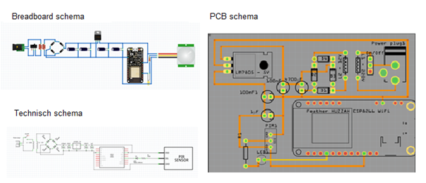
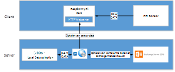

# Summary
* [Abstract](#Abstract)
* [Dankwoord](./dankwoord.md)
* [Introductie](./introductie.md)
  * [Digipolis Antwerpen](./digipolisantwerpen.md)
  * [Onderzoeksvraag van het project](./onderzoeksvraag.md)
     * [Selectie van het project en probleemstelling](./sigfox.md)
         * [Sigfox QW Developerskit](./sigfox.md)
         * [De accurate telling van mensen in het gebouw tijdens een evacuatie](./evacuatie.md)
         * [Opvolgen van de luchtkwaliteit in het gebouw in real-time](./luchtkwaliteit.md)
         * [De bezettingsgraad van conferentie ruimtes optimaliseren](./beheervergaderzalen.md)
* [Technisch](./analyse.md)
     * [Analyse](./analyse.md)
         * [Het ontwikkelingsproces](./ontwikkelingsproces.md)
	     * [Arduino UNO met WizFi210 Shield en PIR Sensor](./arduinouno.md)
	     * [Arduino Featherwing HUZZAH ESP8266](./featherwing.md)
	     * [Raspberry Pi Zero](./rbpizero.md)
	     * [Raspberry PI 3B](./rbpib3.md)
	     * [PIR-STD-LP](./pirstdlp.md)
	 * [Design](./design.md)
	     * [Raspberry Pi 3B en Passieve Infrarood sensor](./rbpi3bpir.md)
	     * [NSX Normalized systems](./nsx.md)
	     * [De Web Service API en Exchange Server 2016](./webserviceapi.md)
	     * [De Hostsesrver](./hostserver.md)
	 * [Het ontwikkelingsprocess en toegepaste technologieën](./ontwikkelentoegepast.md)
	     * [Interactie](./interactie.md)
	     * [Hardware](./hardware.md)
	     * [Software](./software.md)
	     * [Externe services](./externeservices.md)
* [Kritische reflectie](./reflectie.md)  
* [Besluit](./besluit.md)
     * [Resultaat](./resultaat.md)
         * [Raspberry Pi 3B en Python 3](./rbpi3bpython3.md)
         * [NSX](./resultaatnsx.md)
         * [Web Service API en Exchange Server 2016](webserviceexchange.md)
         * [De toekomst van het project](./toekomst.md)
     * [Samenvatting](./samenvatting.md)
* [Bibliografie](./Bibliografie.md)
     * [Gevolgde cursussen](./cursus.md)
     * [Geraadpleegde bronnen](./bronnen.md)
         * [Online bronnen](./onlinebron.md)
         * [gepubliceerde bronnen](./pubbron.md)
* [Glossary](./glossary.md)

#Abstract

Het pilootproject omvat een geautomatiseerd zaalreserveringssysteem beheerd in Exchange server 2016 met een Raspberry Pi 3B en een PIR-STD sensor. Het project is stapsgewijs tot stand gekomen. Dit is het eerste Internet of Things hardware project bij Digipolis Antwerpen dat intern werd ontwikkeld. Het project is gestart met een betaalbare technologie en een simpele autonomie, zoals de Arduino Uno microcontroller en een Passive Infrared Sensor (PIR) om activiteit in een vergaderzaal te detecteren. Naarmate het project vorderde is het project geëvolueerd naar het gebruik van meer intelligente hardware, zoals de Raspberry Pi 3B, om aan de projecteisen te voldoen. Zo heeft de Raspberry Pi 3B een ingebouwde ethernet poort, wifi en Bluetooth om het project van de nodige connectiviteit te voorzien. Op de Raspberry Pi 3B draait het Linux Raspbian operating systeem met een Python 3 script om de sensors uit te lezen. De hardware werd verder uitgebreid met een PIR-STD-LP sensor en een Led. De software werd aangevuld met een RabbitMQ MQTT Broker die bij NSX Normalized Systems wordt gehost. De hard- en software zijn in staat om in eerste instantie bewegingen te detecteren wat de aanwezigheid van mensen verondersteld. In de toekomst kan er een DHT22 of MQ-135 sensor aan worden toegevoegd. De DHT22 sensor kan de temperatuur alsook de vochtigheidsgraad meten terwijl de MQ-135 veel voorkomende (giftige) gassen kan opsporen. Deze sensoren zullen later in de scriptie nader besproken worden. De software die deze gegevens interpreteert zal de dataset verrijken in de toekomst. Tijdens deze fase van het project worden de technieken (zowel hardware als software) bestudeerd, geëvalueerd en bijgestuurd met de resultaten van de uitgevoerde testen. Op die manier wordt het proces steeds verder verfijnd en worden werkende deelprojecten gerealiseerd.

#Dankwoord

Een eindwerk maken, is een laatste stap naar het behalen van een diploma, en tegelijk een eerste stap in de werkwereld. Het is een unieke kans om na jaren studeren je theoretische kennis om te kunnen omzetten in een “eigen onderzoek” door middel van een stageperiode. Uiteraard gaat dit gepaard met vallen en opstaan, en heb je de steun en ervaring van anderen nodig. Ik zou dan ook graag mijn dank willen betuigen aan al deze personen die mij hebben bijgestaan bij het voltooien van dit eindwerk.

In eerste instantie zou ik de heer Rudi DeGeest en mevrouw Greet Broosens, willen bedanken omdat zij mij de mogelijkheid hebben gegeven mijn stage te volbrengen in Digpolis Antwerpen. 

Verder wil ik Patrick Van Houtven bedanken voor de fantastische sfeer waarin ik steeds heb mogen werken en voor de tijd die hij heeft vrijgemaakt om mij heel wat kennis en techniek bij te brengen.

Ook zou ik mijn promotor  de heer Maarten Luyts, docent, stagecoördinator en  trajectbegeleider aan het AP hogeschool willen bedanken voor de begeleiding gedurende mijn stageperiode, het nalezen en verbeteren van dit werk.

 Daarnaast gaat mijn dank uit naar Kris Proost en Pascale Raeymaekers omdat zij tijd vrij hebben gemaakt voor het nalezen en verbeteren van dit werk en voor hun emotionele ondersteuning.

Mijn laatste dankwoorden zijn voor mijn vrienden. Bij hen kan ik altijd terecht voor hulp en zij hebben mij gesteund gedurende al mijn studiejaren.

#Introductie

Deze bachelorproef heeft als doelstelling de gebouwen van Digipolis Antwerpen te laten doorgroeien in het digitale tijdperk. Hierbij wordt onderzocht wat Internet of Things kan betekenen.
 

Met Internet of Things worden alledaagse voorwerpen met elkaar verbonden door het internet waardoor ze in staat zijn gegevens uit te wisselen tot zelfs autonome beslissingen te nemen. Slim gemaakte toestellen die allerlei gegevens capteren, doorgeven en bewaren, ook persoonsgegevens. Gezien deze ontwikkelingen razendsnel evolueren en gegevensoverdrachten niet meer te controleren zijn, werd de Europese richtlijn waarop de Belgische Privacywet is gebaseerd, vervangen door een Europese verordening. Die ziet erop toe dat de privacy van Europese burgers gerespecteerd wordt en hun gegevens veilig getransporteerd en opgeslagen worden.

Deze technologische ontwikkelingen drukken zich de dag van vandaag uit in een slimme stad ofwel “Smart City”. Door informatietechnologie optimaal in te zetten, kan het besturen en beheren van een stad veel efficiënter gebeuren. Met de integratie van fysieke, digitale en menselijke interactiesystemen in de omgeving van gebouwen (Smartbuildings), wordt de levenskwaliteit gaandeweg verhoogd. De GDPR-regelgeving garandeert een bescherming van de privacy en ziet erop toe dat het dataverkeer veilig verloopt en gegevens in beveiligde omgevingen worden opgeslagen. Het spreekt voor zich dat besturen zich dienen te houden aan de meest strikte regels van deze reglementering.

In deze scriptie wordt beschreven hoe “Smartbuildings @ Digipolis: De bezettingsgraad van conferentieruimtes optimaliseren” tot uiting is gekomen.

##Digipolis Antwerpen
Digipolis Antwerpen wil zijn doorgedreven digitalisering en de daarbij horende stabiliteit ook in eigen huis verder ontwikkelen en gestalte geven. Dit wil zeggen dat de afdeling Digipolis Antwerpen zijn ruimtes optimaal wil benutten. Meer nog, zij willen via een digitaal platform alle bevoegde instanties en medewerkers informeren over hun intern gebruik van alle accommodatie en multimedia in het gebouw.
##Onderzoeksvraag van het project

De onderzoeksvraag bij Digipolis Antwerpen: Wat zijn de mogelijkheden met Internet of Things om het Digipolis-gebouw verder te laten evolueren in de wereld van Smartbuildings? Tijdens de eerste weken van de stage is er onderzocht wat project hiervoor het meest in aanmerking zou komen. Voordat het project van “Smartbuildings @ Digipolis: De bezettingsgraad van conferentie ruimtes optimaliseren” werd gekozen is er een voorafgaand onderzoek gebeurd. De beschikbare projecten bestonden uit:

* Zoek een nuttige toepassing voor de Sigfox QW Developerskit.
* Zoek een methode voor een accurate telling van mensen in het gebouw om een evacuatie zo vlot mogelijk te laten verlopen.
* Zoek een methode om in real-time de luchtkwaliteit in het gebouw te analyseren.
* De bezettingsgraad van conferentie ruimtes optimaliseren.

Deze projecten worden nader bekeken en geëvalueerd om later in de praktijk te worden omgezet. Belangrijke aspecten om als kandidaat project geselecteerd te worden moet het project voldoen aan de privacy wetgeving en kunnen functioneren binnen de beveilingsvereisten van Digipolis Antwerpen. Het project van deze scriptie is een hardware pilootproject binnen Digipolis Antwerpen, daarom is het budget en de beperkingen voor het project niet bekend. Deze beperkingen worden tijdens het onderzoek en het ontwikkelingsproces vastgelegd op basis van de bevindingen. De bevindingen moeten in kaart brengen wat al dan niet mogelijk is binnen het beleid van Digipois Antwerpen. Het is belangrijk hier rekening word gehouden met de aspecten van de privacy wetgeving, de kosten van het project en de in huis bronnen om het project naar de toekomst toe verder te ontwikkelen. Dit laat Digipolis Antwerpen toe om in de toekomst een beter inzage te geven in de praktische uitwerking van Internet of Things projecten binnen Digipolis Antwerpen zelf.

##Selectie van het project en probleemstelling
###Sigfox QW Developerskit

Digipolis Antwerpen is al enige tijd bezig zich te verdiepen in de wereld van Internet of Things. Al voor de stage begon, heeft Digipolis Antwerpen een QW Development Kit ter beschikking gekregen om zo te onderzoeken wat Sigfox voor Digipolis Antwrpen kan betekenen. Omdat Digipolis geen interne hardware ontwikkelaars heeft die zich specialiseren in Internet of Things, is de Sigfox QW module al een tijdje blijven liggen. Hieruit vloeide de vraag om een nuttige toepassing voor de Sigfox QW module te vinden en te achterhalen of dit een haalbaar project is voor deze scriptie.

De eerste vraag die Digipolis Antwerpen stelt is: “Wat is de QW Development Kit en wat zijn de capaciteiten ervan?” De QW Development Kit is een standalone Mbed prototype board dat gebaseerd is op het Arduino platform. Dit platform is programmeerbaar via de Arduino IDE of door het gebruikt van AT (Hayes) commando’s. Het prototype board dat gebaseerd is op het NUCLEO-L152RE board heeft naast een ISM 868MHz Sigfox Low power Wide area network (LPWAN) modem (op basis van een TD1204 modem) nog een hele waaier aan sensoren ter beschikking zoals een accelerometer, actieve GPS antenne, lichtgevoelige sensor (VCNL4010), proximity en analoge temperatuur sensors (MCP9700). Verder beschikt de module over 26 digitale en 9 analoge poorten die kunnen gebruikt worden om het systeem uit te breiden. Het QW Development Kit kan functioneren op een 2.3 Volt tot 3.6 Volt stroombron waardoor deze module geheel mobiel gebruikt kan worden om sensordata te verzamelen en deze te verzenden. Sigfox laat toe om 140 berichten van 12 Bytes (exclusief transmissie en header informatie) berichten te verzenden (uplink) en 4 berichten van 8 Bytes per dag te ontvangen (donwlink).

De tweede vraag van Digipolis Antwerpen luidt: “Wat kunnen we met deze module doen?” Indien nodig, rijdt er een interne koerierdienst van Digipolis Antwerpen naar andere hoofdlocaties van de stad zoals de Bel-toren en Perméke-bibliotheek. Om deze koerierdienst beter op te volgen kan de Sigfox module in de koerier zijn voertuig geïntegreerd worden. Zo kan de locatie van de koerierdienst op afstand gevolgd worden en een mogelijk digitaal manifest van de lading bij punt A worden geüpload en bij punt B worden gedownload. Zo kan de administratie en inventarisatie van goederen die tussen de Digipolis locaties verdeeld worden vlotter verlopen.
Om het project tot zijn recht te kunnen laten komen, is het nodig om de juiste beveiligings- en overheidsprotocollen, verzekeringen en een budget voor het installeren van de hardware in de koerierwagen aan te vragen. Het was moeilijk in te schatten of dit allemaal in orde zou kunnen komen binnen de lopende stageperiode. De conclusie was dat het project niet haalbaar was voor deze scriptie.

###De accurate telling van mensen in het gebouw tijdens een evacuatie.

In de gebouwen van Digipolis zijn dagelijks enkele honderden mensen aanwezig. In geval van evacuatie wordt er via de intercom een boodschap afgeroepen. Het is echter heel moeilijk om te achterhalen of iedereen daadwerkelijk het gebouw heeft verlaten. Nadat de boodschap tot evacuatie is afgeroepen, moet de verdiepingverantwoordelijke, voor zover mogelijk, zijn verdieping controleren om te voorkomen dat er iemand achterblijft. Dit is een tijdrovende opgave waardoor bij brand of rookontwikkeling de verantwoordelijke zichzelf in gevaar kan brengen. Digipolis Antwerpen vroeg zich af wat Internet of Things hierin voor hen kon betekenen.

Een belangrijk aspect echter was dat de systemen die het aantal mensen tellen of detecteren geen resten mag nalaten in het dagelijks leven van de werknemer of de bezoekers van Digipolis Antwerpen, immers zij dienen te voldoen aan de strengste vereisten van de Privacywet (GDPR). Optische sensoren zoals camera’s of het verzamelen van biometrische gegevens is een zeer gevoelige kwestie in verband met de GDPR. Tijdens het onderzoek naar de mogelijkheden voor dit project zijn een groot aantal system beken waaronder Infrarood sensors die mensen konden tellen, intelligente drukgevoelige matten, ultrasone sensors, een mobiele RFID badgescanners en een automatisch bericht dat weergeven wordt op alle actieve pc's die aanwezig zijn in het complex.

Een autonoom passieve infrarood sensor (PIR) netwerk op batterijen die per verdieping is geïnstalleerd en zo een hele verdieping in het oog kan houden, zou één van de minst indringende oplossingen zijn. Dan hoeft de verdiepingverantwoordelijke enkel nog de toiletten te controleren alvorens zelf het gebouw te verlaten. Uit het onderzoeken naar de haalbaarheid van dit project voor de scriptie, is gebleken dat hiervoor toch heel wat toestemmingen nodig zijn voor het implementeren van het systeem. Bij nood kunnen de stroomvoorzieningen van het gebouw uitgeschakeld worden, hierdoor zou het detectiesysteem van een eigen stroombron voorzien moeten zijn. Voor het plaatsen van lithium batterijen in de infrastructuur van overheidsgebouwen was een hogere beveiligingstoestemming nodig om dit project te kunnen realiseren. Bovendien moest dit ook allemaal protocollair-gewijs aangevraagd worden bij o.a. de veiligheidscommissie. Daarnaast moet ook het budgettaire aspect om de hardware aan te kopen en te testen in rekening genomen worden, wat veel tijd in beslag zou nemen gezien de organisatie aan de Wet op de Overheidsopdrachten is onderworpen. Digipolis Antwerpen wenst te investeren in een waterdicht systeem dat op basis van passieve systemen die onopgemerkt blijven voor de bezoeker of werknemer en geen gebruikershandelingen vereisen wat moeilijk haalbaar is binnen de korte periode van de stage. Hierdoor werd dit project na enkele weken jammer genoeg niet verder uitgewerkt.

###Opvolgen van de luchtkwaliteit in het gebouw in real-time.

Digipolis Antwerpen bestaat uit twee grote gebouwen met elk zes verdiepingen. Het gebouw is voorzien van een airconditioningsysteemnet. Om die reden is het gebouw voorzien van vaste ramen die niet opengezet kunnen worden. Digipolis Antwerpen stelt zich de vraag of het via Internet of Things mogelijk is om de luchtsamenstelling in heel het gebouw in kaart te brengen. Tijdens het onderzoek is er gekeken naar een Arduino en Raspberry Pi gekoppeld aan sensoren zoals MQ-135 gas sensor die die veelvoorkomende gassen detecteert die de luchtkwaliteit in het dagelijkse leven bepalen. Deze sensor werkt op 5 Volt en is compatibel met een hele reeks microcontrollers. Deze sensor uit de MQ familie detecteert gassen zoals:

* Alcohol of ook voorkomend in de vorm zoals ethanol (C2H5OH) kan terug gevonden worden in bijvoorbeeld schoonmaakproducten, verf en verfverwijderaars. Lange blootstelling aan deze stof kan bij sommige mensen duizelingen en misselijkheid veroorzaken.
* Ammoniak (NH3) is een verbinding tussen waterstof en stikstof. Op kamer temperatuur is deze giftig, kleurloos en brandbaar met een specifieke prikkelende geur die door alle mensen wordt uitgeademd en zich kan opstapelen in slechte verluchte gebouwen.
* Benzeen is een organische verbinding die bijvoorbeeld vrijkomt bij tabaksrook en uitlaatgassen. Bij kamertemperatuur bestaat benzeen uit een kleurloze vloeistof met onaangename geur. In een sigaret zit tussen de 0.01-0.05mg benzeen. Deze stof beschadigt DNA en kan op lange termijn kanker  veroorzaken.
* Koolstofdioxide (CO2) is een anorganische verbinding van zuurstof en koolstof. Dit is een geurloos en kleurloos gas dat samen met waterdamp koolzuurgas vormt. In hogere concentraties is koolstofdioxide giftig.
* Stikstofoxiden (Nox) is een verzamelnaam voor stikstof en zuurstof. Dit is een bijproduct als er op hoge temperaturen verbrandingen gebeuren. 

Bij nader onderzoek van dit project bleek dat het implementeren van deze sensor in het huidige ventilatiesysteem niet praktisch was omdat veel interne systemen afhangen van externe onderhoudscontracten. Het aanvragen van de nodige permissies en integratie in het bestaande systeem zou teveel tijd met zich meebrengen om deze voor een scriptie te gebruiken. Hierdoor kwam het project van luchtkwaliteit ook niet in aanmerking voor deze scriptie.

###De bezettingsgraad van conferentie ruimtes optimaliseren

Bij Digipolis Antwerpen kunnen de vergaderruimten zowel door  medewerkers als door scholen, politie en andere organisaties gehuurd worden. De druk op de zalen is 
hoog door intern georganiseerde vergaderingen. Gezien de hoge nood aan vergaderruimtes en het aantal vergaderplaatsen echter beperkt is, dringt optimalisering zich op. Een vaak voorkomend probleem is dat een vergadering niet plaats vindt of vroegtijdig gedaan is zonder dat de reservering geannuleerd of aangepast wordt. Om dit te voorkomen en het plaatstekort aan vergaderzalen het hoofd de bieden, heeft Digipolis Antwerpen de vraag gesteld of Internet of Things ervoor kan zorgen dat de beschikbare conferentieruimtes optimaal benut worden?

Door het toepassen van de actuele mogelijkheden beschikbaar in de wereld van Internet of Things is het haalbaar om vergaderzalen automatisch te beheren door het inzetten van sensors. Door het implementeren van verschillende sensoren die informatie vergaren, zou de beschikbaarheid van vergaderzalen in kaart gebracht moeten kunnen worden. De verzamelde gegevens zouden na verloop van tijd geanalyseerd worden waarbij de mogelijkheid verkregen wordt om het toekomstige gebruik van de vergaderzalen te kunnen voorspellen en te optimaliseren. In eerste instantie moet er uitgezocht worden welke technologie gebruikt zou kunnen worden om zo rendabel mogelijk een prototype te kunnen ontwerpen. Hierbij was het ook van belang dat de werking van dit systeem voldoet aan de verschillende regelgevingen en protocollen waaraan moet worden voldaan. Langzamerhand werd het nogmaals duidelijk dat budgettaire- en beveiligingsprocedures het project zullen beïnvloeden en het realiseren van het project niet gemakkelijk zal zijn.

Het onderzoeken van de mogelijkheden en beperkingen, rekening houdend met de privacy wetgeving (GDPR), nam zoals steeds veel tijd in beslag. In het verloop van het onderzoek zijn een aantal technologieën die in aanmerking kwamen voor het project getest. Een aantal van deze technologieën die heel interessant zijn voor dit project zijn geschrapt omdat de data zich niet buiten het intranet mag verplaatsen of dat de technologie een beveiligingsrisico voor het gehele netwerk vormde.

Ondanks deze vooruitzichten is dit pilootproject het meest haalbare zowel qua tijd als budget. Tot op heden is er intern nog geen infrastructuur hiervoor aanwezig. Dit maakte van het pilootproject een uitstekende uitdaging voor een scriptie.

#Techinsch
##Analyse

In het begin van de stage werd er gekeken naar wat mogelijk is voor de stage opdracht en hoe deze aan te pakken. Ook werden optionele paden overwogen om de stage opdracht aan te vullen met andere projecten waar het Internet of Things in kon worden toegepast zoals het evacuatieplan. Deze bachelorproef zou een pilootproject worden binnen Digipolis Antwerpen. Voor aanvang van dit project hebben er zich geen interne hardware projecten binnen Digipolis plaatsgevonden. Voor dit pilootproject was er nog geen omkadering bekend en was er ook nog geen budget vastgesteld. Om deze omkadering uit te tekenen is er gekozen om van in het begin met simpele technologie te starten en het project stapsgewijs uit te bouwen met meer intelligente hardware. Op die manier kunnen de beperkingen en complexiteit van hardware projecten binnen Digipolis Antwerpen in kaart gebracht worden. Het gekozen pilootproject waarbij de bezettingsgraad van vergaderzalen geoptimaliseerd wordt door het inzetten van sensors, zal door drie fasen van het ontwikkelingsproces gaan.

* De eerste fase is development waar mogelijke technologieën en potentiële hardware zal worden onderzocht om dit project tot uiting te brengen. In deze fase moeten ook de beperkingen naar boven komen van wat al dan niet mogelijk is binnen de infrastructuur van Dgipolis Antwerpen. Hierbij staat de beveiliging van het netwerk, de aanwezige data en de wet van de privacy voor personeel en bezoekers voorop.
* De tweede fase is acceptatie waar de het ontwikkelde prototype en de bijhorende software zal getest worden. In deze fase moeten mogelijke veiligheidsrisico’s naar boven komen en verholpen worden. Het prototype zal ook in de praktijk getest worden in een vergaderzaal.
* In de derde en laatste fase, de productie, zal het project verder worden uitgerold naar meerdere vergaderzalen op voorwaarden dat zowel de hardware als de software voldoet aan de criteria en eisen die Digipolis Antwerpen stelt aan dit hardware project.
###Het ontwikkelingsproces

Om dit pilootproject tot uiting te kunnen laten komen, werd een hele reeks aan technologieën in overweging genomen zowel voor wat hardware als software betreft. Voorheen waren er nog geen specificaties, limitatie of omkadering bekend waardoor een rode draad onbestaande was. Zodoende is dit Internet of Things pilootproject stapsgewijs opgebouwd met als startpunt een simpele microcontroller technologie zoals de Arduino UNO die later evolueerde naar een meer intelligente microcontroller zoals de Raspberry Pi 3B die een Broadcom BCM43438 2.4GHz 802.11N Wifi-chip geïntegreerd heeft om aan de draadloze netwerk beveiligingsvereisten van Digipolis te kunnen voldoen naarmate er meer duidelijkheid kwam in de omkadering van het project. Voor dit project werd er gekozen om Wifi te gebruiken in plaats van Sigfox of Lora omdat alle vergaderzalen zich binnen het gebouw van Digipolis Antwerpen bevinden en er een zeer redundant wifinetwerk beschikbaar is. Zo zijn er drie gratis wifi hotspots in het gebouw beschikbaar elk met hun eigen unieke naam (SSID). Daarnaast zijn er drie privé-netwerken die voorbehouden zijn voor Digipolis zelf.

Vanaf het begin van het pilootproject is er wekelijks een overleg met de stagepromotors van Digipolis Antwerpen georganiseerd om zo het project op te volgen en af te bakenen. Hierdoor werd er scherp gesteld wat er al dan niet mogelijk is. Zo leefde in het begin van het project nog de intentie om een PowerShell script te gebruiken waarmee via de Exchange Web Service API (EWS) de reserveringen van de vergaderzalen beheerd konden worden. Bij het gebruik van PowerShell scripts rijst de bezorgdheid om de veiligheid van het Digipolis netwerk. Hierbij stelde zich de vraag naar het verkrijgen van de execution policies, nodig om een standalone script op de servers te laten lopen. Gedurende de eerste helft van de stage zijn er een heel aantal voorstellen geweest die stukje bij beetje hun bijdrage hadden om dit project vorm te geven. De voornaamste stappen zijn hieronder beschreven alsook de bijdrage die ze aan het project hebben geleverd in functie van het afbakenen en het omkaderen van wat voor Digipolis aanvaardbaar is om als project in de realiteit te worden omgezet.

####Arduino UNO met WizFi210 Shield en PIR Sensor

De Arduino UNO is een uitstekende kandidaat voor herhalende taken zoals het verzamelen van sensordata. Deze kleine microcontroller werkt op 5V en heeft als kern een ATmega328P chipset die de functionaliteit aan de microcontroller geeft. Arduino UNO heeft een 16MHz kloksnelheid en een 32kb flashgeheugen dat op de ATmega328P chip zit verwerkt. De Arduino UNO heeft 14 Digitale input/output pinnen waarvan 6 een PWM functionaliteit hebben. Iedere pin kan tot maximaal 20mA stroom aan. Dit is genoeg om de meeste standaardsensoren aan te sturen. Door de eenvoud van deze microcontroller zou dit een uitstekende oplossing kunnen zijn voor het project. De WizFi shield is een gemakkelijk te monteren shield op de Arduino UNO. Dit wifi prototype shield is zo opgebouwd dat deze eenvoudig te monteren is op de Arduino UNO. Zo maakt de WizFishield gebruik van een UART interface. De ESP8266 chipset die de WizFishield geïntegreerd heeft, ondersteunt wifi standaard 802.11 b/g/n en accesspunt modus. Uit de specificatie documentatie was af te leiden dat deze module de nodige WPA2-Enterpise vereisten zou ondersteunen.

In eerste instantie lag de focus op het gebruik van sensors en het aanspreken van de Exchange Server. Hierbij werden Arduino UNO Rev.3 en een Passive Infrared Sensor (PIR) gebruikt om de activiteit in een vergaderzaal te detecteren. De Arduino UNO microcontroller geeft sensordata draadloos door aan een server die een PowerShell script host. Hiervoor maakt de Arduino UNO controller gebruik van een zelfstandige ESP8266 wifimodule. De bedoeling is dat het PowerShell script controleert op de Exchange Server of de vergaderzaal gereserveerd is door de Exchange Web Service API (EWS) aan te spreken. Zo vergelijkt het script de datum en tijd van de reservatie met de ontvangen sensordata. Als het script de eerste 30 minuten van de vergadering of 20 minuten nadat de vergadering is begonnen, geen activiteit detecteert in de vergaderzaal dan zal het script de reservering van de vergadering op de Exchange Server annuleren. Zo kan de vergaderzaal door iemand anders opnieuw geboekt worden. De events die het script onderneemt, zouden worden bijgehouden in een PostgreSql databank. De databank verzamelt informatie over de bezetting en de redenen waarom de reservatie van de vergaderzaal werd geannuleerd. Er wordt gekozen voor apparatuur op batterijen. De architectuur zou er als volgt uitzien:

Het eerste probleem dat zich voordeed bij het testen van het Arduino UNO prototype en de WizFi210 shield, was de verbinding van de Arduino met het wifi netwerk van Digipolis. Deze gebruikt WPA2-Enterprise PEAP-MSSHAPv2 encryptie. De ondersteuning van Enterprise encryptie voor Arduino UNO en de WizFisheild met de ESP8266 chipset bleek echter te beperkt te zijn. Er zou de mogelijkheid bestaan om een nieuwe firmware te installeren maar deze was betalend om de Enterprise security functionaliteit te kunnen gebruiken. Als oplossing voor dit probleem kan een Root Certificaat binair op de Arduino geplaatst worden. Daarenboven blijkt dat Arduino geen betrouwbare CA authenticatie heeft en kwetsbaar is voor “man in the middle attacks”.

Na het voorleggen van deze problemen werden de risico’s voor de beveiliging van het Digipolis netwerk gewogen en te zwaar bevonden door de stagementors van Digipolis Antwerpen. Bijgevolg is het gebruik van een Arduino en PowerShell geschrapt voor dit project. Het gebruik van PowerShell op een apparaat dat kwetsbaar is voor netwerk intrusies en het opslaan van Binaire netwerkcertificaten is een te groot veiligheidsrisico en onaanvaardbaar voor Digipolis. Daarnaast verkiest Digipolis ook een openssource oplossing. Er zal ook geen gebruik gemaakt worden van apparaten die gevoed worden met batterijen. Bij het gebruik van batterijen moet je de goedkeuring hebben van de veiligheidscommissie. Immers, het integreren van van lithium batterijen in een gebouw is niet geheel zonder gevaar gezien lithium een ontvlambare substantie is en aangegeven moet worden bij de brandweer. Ook het onderhoud van batterijen brengt kosten met zich mee. Om deze redenen zal er voor een testopstelling gekozen worden dat werkt op netstroom. Er wordt besloten om verder op zoek te gaan naar alternatieven waarbij het gebruik van vergaderzalen verder geoptimaliseerd kan worden.

####Arduino Featherwing HUZZAH ESP8266

Bij een volgende opstelling werd er gekozen om met een Arduino Featherwing HUZZAH te werken. De Arduino Featherwing HUZZAH is kleiner dan de Arduino UNIO en heeft een geintegreerde ESP8266 chipset. Ook hierbij controleert een script op de Exchange Server of de vergaderzaal gereserveerd is door de Exchange Web Service API (EWS) aan te spreken. Het schema ziet er dan als volgt uit:
 

In tegenstelling tot de eerste testopstelling, werd er niet gewerkt met apparatuur gevoed door batterijen maar met apparaten die hun voeding uit netstroom halen.
 

Zoals eerder bleek, was de verbinding van de Arduino met het wifi netwerk van Digipolis een obstakel. Deze gebruikt WPA2-Enterprise PEAP-MSSHAPv2 encryptie. Een Arduino Uno met externe ESP8266 wifi module, blijkt geen waardig alternatief voor de eerste gefaalde proefopstelling gezien de ondersteuning van Enterprise encryptie voor Arduino eerder beperkt is.
 

Tijdens het overleg bleek dat het niet eenvoudig zou zijn om een goedkeuring te krijgen voor de eigengemaakte voeding (de voeding zou via netstroom verlopen en niet via batterijen zoals in de eerste opstelling). De procedure die gevolgd moet worden is te lang en waarschijnlijk niet haalbaar in deze stageperiode. Bovendien kunnen er geen veiligheidscertificaten voorgelegd worden en ontbreken doeltreffende betrouwbaarheidstesten voor de stepdownconverter die de veiligheidsrisico’s voor Digipolis tot nul moeten reduceren.

Ook deze testopstelling krijgt een no-go. Enerzijds vergt het eigen PCB-design een lange procedure om tot een goedkeuring en een certificiëring te komen die quasi onmogelijk gerealiseerd kan worden binnen de periode van deze stage. Anderzijds blijft de externe ESP8266 wifi module problemen genereren bij het gebruik van Enterpise level encryptie.

####Raspberry Pi Zero

Gezien de eerste fase problemen gaf in verband met de garanties die de netwerkbeveiliging van Digipolis Antwerpen vereisen, kwam een volgende fase in zicht waarbij de inzet van meer intelligente hardware getest kan worden. Hiervoor komt de Raspberry Pi Zero en de Raspberry Pi 3B in aanmerking. Het opstellen van een volwaardige test-setup van de Raspberry Pi Zero zou extra kosten met zich meebrengen. De Raspberry Pi Zero heeft geen interne wifi module wat de aankoop van een wifi shield en extra onderdelen nodig om een prototype te bouwen zou vereisen. Een alternatief zou de Rarspberry Pi Zero W kunnen zijn, maar gezien de hardware voor het project al besteld was en de late release date van 28 februari 2017, komt deze niet meer in aanmerking. Ook de aankoop van losse onderdelen voor de Raspberry Pi Zero zou het project danig vertraging kunnen bezorgen gezien de aankoopprocedures de Wet op de Overheidsopdrachten moeten volgen.

Het gebruik van Raspberry Pi Zero zou extra aankopen met zich meebrengen. Dit brengt de haalbaarheid in het gedrang gezien de aankoopprocedures het project kunnen vertragen gezien de Wet op de Overheidsopdrachten gevolgd moet worden. Bovendien heeft de Raspberry Pi Zero geen meerwaarde in vergelijking met een volwaardige Raspberry Pi 3B.
Er is geen testhardware beschikbaar gezien de Raspberry Pi Zero, WiFi shield en extra onderdelen zoals pins, usb kabel converter zouden moeten worden aangekocht. De prijs van dit alles komt overeen met een volwaardige Raspberry Pi 3B die hiermee in zicht komt als alternatief voor de Raspberry Pi Zero.

De Raspberry Pi Zero blijkt te duur en het samenstellen te complex voor de noden die er leven. Digipolis heeft post stage geen interne elektronica techniekers ter beschikking om de hardware samen te stellen of te debuggen. De Raspberry Pi Zero W zal later in de scriptie nog besproken worden als kandidaat. Er wordt gekeken naar een Raspberry Pi 3B als alternatief voor de Raspberry Pi Zero. 

####Raspberry Pi 3B

De Raspberry Pi 3B geeft het project meer mogelijkheden. Zo kan er gekozen worden voor een Linux of Windows IoT .NET Core besturingssysteem. De netwerkbeveiligingsstandaard is ook veel beter omdat de Raspberry Pi 3B een volwaardig besturingssysteem heeft. De Raspberry Pi 3B heeft zowel een draadloze wifi als een wired Ethernet verbinding. Verder kunnen er ook meer intelligente sensors aangesproken worden zoals camera's en displays. Zo zou een camera bijvoorbeeld gebruikt kunnen worden om de zitplaatsbezetting op te volgen in de vergaderzaal. Een interactief display zou de boeking van de zaal kunnen weergeven en gebruikers de mogelijkheid geven om een vergaderzaal op locatie te boeken voor een toekomstige vergadering. Digipolis is gebonden aan een strenge wetgeving en privacy beleid. Daarom is het gebruik van een camera in dit project niet van toepassing.

Voor het project worden er twee identieke prototypes gebouwd. Een eerste prototype is gebaseerd op een Rasberry Pi 3B die aan het 220V stroomnetwerk wordt gekoppeld. Op de Raspberry Pi 3B wordt een Python script gehost die de sensordata van de Passive Infrared Sensor (PIR) verzamelt. Het besturingssysteem van de Raspberry Pi 3B staat nog niet vast. De verzamelde data wordt via Message Queueing Telemetry Transport (MQTT) gepubliceerd en naar de lokale netwerk server die een Web service API in een Docker omgeving host. De Raspberry Pi 3B is de MQTT Publisher die de sensordata verzameld. Vervolgens ontvangt de MQTT Broker op de server de sensor telemetrie data. De Web Service API vergelijkt de ontvangen sensor data van de MQTT Broker met de reservering op Exchange Server. Als een vergaderzaal gereserveerd is, kan deze terug vrijgegeven worden na het vergelijken van de data wanneer er gedurende een bepaalde periode geen activiteit waargenomen werd.

Ook hier wordt er gebruik gemaakt van dezelfde condities als die voorheen voor het PowerShell script werden bepaald. De ontvangen activiteitdata wordt vergeleken met de datum en tijd van de reservering. Zo weet de Web Service API of er iemand in de vergaderzaal zit. Als in het begin van een reservering of na een periode wanneer de vergadering begonnen is, er geen activiteit plaatsvindt, dan kan de Web Service API de reservering annuleren. Zo kan de beschikbaarheid van de vergaderzalen optimaal benut worden. Het NSX platform verwerkt de ruwe sensordata enerzijds tot realtime leesbare data voor de API, anderzijds zorgt het NSX platform voor het opslaan van de sensordata in .JSON op het datalake van iOT platform van Digipolis.

De sensoren kunnen aangevuld worden met andere meettoestellen of toepassingen. Tijdens de onderzoeksfase bleek dat het integreren van een microfoon voor het detecteren van geluid geen optie zou zijn. Enerzijds is de wetgeving op de privacy een beperkende factor. Anderzijds levert het slechts een beperkte winst op in de functionaliteit. Gezien de microfoon enkel gebruikt wordt om geluid te detecteren in de ruimte, zou het dezelfde functie opnemen als de PIR sensor (deze detecteert eveneens de aanwezigheid van objecten), wat geen meerwaarde levert aan het project. De PIR sensor heeft voorrang op de microfoon gezien deze nagenoeg geen invloed heeft op de Privacywetgeving. Het initiële prototype zal zich richten tot het implementeren van enkel een PIR sensor maar zal wel de DHT22 sensor in de documentatie opnemen om de verdere evolutie van het project te ondersteunen na de stage.

####PIR-STD-LP

Voor de PIR sensor is gezocht naar een flexibele passieve infrarood sensor met een zeer laag verbruik en die opties biedt naar de toekomst toe. Bovendien kan deze sensor enkele handelingen autonoom uitvoeren zonder hulp van een extra microcontroller zoals Arduino of Raspberry Pi. Zo heeft de PIR-STD-LP sensor van B+B een ingebouwde lichtgevoelige weerstand (LDR) waardoor de hoeveelheid licht in een ruimte gemeten kan worden. Een OUT signaal kan een power relay aansturen wat het bijvoorbeeld mogelijk maakt het licht of andere apparatuur in de vergaderzaal in of uit te schakelen waarmee energie bespaard kan worden. Het technische aspect zal later in het design gedeelte van deze scriptie verder besproken worden.

##Design

Uit onderzoek is de architectuur ontstaan die hieronder wordt geïllustreerd. De rol van NSX Normalized Systems en de configuratie van de Exchange Server worden later in de scriptie besproken. NSX is een extern bedrijf waarmee Digipolis samenwerkt. De configuratie om toegang tot hun data te krijgen, is om veiligheidsredenen beperkt beschikbaar. De privileges tot de Exchange Server configuratie vallen buiten de scope van deze scriptie.

###Raspberry Pi 3B en PIR

Tijdens het onderzoek in dit project is er gekeken naar wat het beste besturingssystem is om de Raspberry Pi 3B aan te sturen. Hiervoor is Raspbian en Windows IoT nader bekeken en getest. De wens van Digipolis was om een systeem te hebben dat gemakkelijk te onderhouden is en eenvoudig kan worden uitgebreid naarmate het project vordert. De Raspberry Pi 3B is een prachtig stukje hardware dat heel veel mogelijkheden biedt. Als kern heeft de Raspbeerry Pi 3B een System on Chip (SoC) Broadcom BCM2837 chipset met een 4xARM Cortex-A53, 1.2GHz CPU en 1GB LPDDR2(900MHz) RAM geheugen. Naast een standaard 10/100 Ethernet verbinding heeft de Raspberry Pi 3B ook een ingebouwde 2.4GHz 802.11n wifi module en een bluetooth 4.1 classic module met daarnaast een aantal aansluitmogelijkheden voor audio, video, camera’s en sensoren. Raspberry Pi maakt Internet of Things zowaar toegankelijk voor iedereen. Zo heeft Raspberry Pi met Raspbian besturingssysteem, een basispakket Python en het programma Scratch aan boord. Dit maakt het aansturen van sensoren gemakkelijk en wel door gebruik te maken van een Python code script met de nodige instructies. Deze scripts zijn gemakkelijk te schrijven in Python en te code is achteraf terug te lezen.

Windows IoT .NET Core is een recente speler in het Internet of Things gebeuren. Omdat dit systeem wel onderzocht maar niet gebruikt werd in het project, wordt deze maar beknopt besproken. De focus bij Windows IoT .NET Core ligt op het gebruik van Microsoft Azure IoT Hub en het gebruik van headless and headed apps die op basis van ASP.NET Core vormen in een minimale Windows Core omgeving. Het is mogelijk om andere programmeertalen te gebruiken in deze omgeving nadat de nodige componenten hiervoor geïnstalleerd zijn op het besturingssysteem. Bij het onderzoek is gebleken dat er hier en daar toch compatibiliteitsproblemen zijn bij het ontwikkelen van apps in Visual Studio als je Python wilt ontwikkelen. De bediening van Windows IoT ASP.NET Core op de Raspberry Pi 3B via PowerShell of Putty maakt het gemakkelijk om het besturingssysteem aan te sturen. Het was van belang voor Digipolis dat het sensor gedeelte zo simpel mogelijk bleef, daarom werd besloten om geen volledig nieuwe app te schrijven om het systeem aan te sturen. Voorheen was ook besloten dat er geen PowerShell gebruikt zou worden om netwerkveiligheidsredenen. Gezien er zich compatibiliteitsproblemen bleven voordoen, is er gekozen om Windows IoT .NET Core niet te gebruiken in dit project.

De Raspberry Pi 3B zal aangestuurd worden door Raspbian, een Linux besturingssysteem dat de stabiliteit garandeert voor langlopende projecten en waarvan het gebruiksgemak bewezen is. De sensoren worden gecontroleerd door een Python 3 script dat bij het opstarten van de Raspberry Pi 3B automatisch data vergaart. Deze data wordt realtime doorgestuurd naar de NSX RabbitMQTT Broker. Een Web Service API, gehost in een Docker omgeving, zal de data ophalen bij NSX middels een MQTT subscription. Door het analyseren van de data en het te vergelijken met de reservaties op de Exchange Server, kan er gekeken worden of de vergaderzaal effectief in gebruik is. Bij een negatief antwoord kan de vergaderzaal vrijgegeven worden voor een volgende gebruiker. Hierdoor wordt de bezettingsgraad geoptimaliseerd.

Er is geen limitatie op het gebruik van Raspbian waardoor het project uitbreidbaarheid is naar andere zalen. De SD kaartjes met het Raspbian operating systeem zijn gemakkelijk te dupliceren. Ook het Python script heeft maar een minimum aan configuratie nodig. Hiervoor dient de hostname, credentials en de MQTT per Raspberry Pi 3B te worden bijgewerkt. Door de hostname als referentie te gebruiken kan de Raspberry Pi 3B op het netwerk teruggevonden worden zonder dat deze beïnvloed wordt mocht er later een statisch of dynamic IP adress toegewezen worden.

Tijdens het onderzoek met Windows IoT Core zijn er toch enkele problemen aan het licht gekomen. Zo diende er onderzocht te worden wat het meest geschikte besturingssysteem zou zijn voor de Raspberry Pi 3B. Al snel bleek dat Windows IoT Core de meeste complicaties met zich meebracht. Er bleken te veel conflicten voor te doen bij het gebruik van Python scripts. Rasphian bleek een betere keuze gezien conflicten nagenoeg niet voorkomen. Een bijkomend voordeel is dat een Raspbian zeer gebruiksvriendelijk is en quasi letterlijk 'plug and play' bleek nadat de libraries geïmporteerd waren.

Bij de ontwikkeling van een ASP.NET Core Web Service API in de Docker met een Windows 10 Home besturingssysteem bleek dat een Windows 10 Pro versie een absolute noodzaak is. Voor de Windows 10 Home versie is er een Docker "legacy" Toolbox met Docker engine 1.12 beschikbaar. Echter deze ondersteunt enkel ASP.NET projecten en niet de laatste ASP.NET Core. Docker for Windows met Docker engine 1.13 of hoger, ondersteunt ASP.NET Core. Het was voor dit Digipolis project van fundamenteel belang dat ASP.NET Core gebruikt werd. Docker vereist Hyper-V en container ondersteuning die alleen in Windows 10 Pro beschikbaar is. Hiervoor was het aankopen van een Windows 10 Pro upgrade nodig.

Als basis voor de Web Service API is er gebruik gemaakt van een code template die door Digipolis is voorzien. Deze code template draagt de naam Eventhandler en is gebaseerd op een ASP.NET Core applicatie. Tijdens het testen van de Digipolis EventHandler ASP.NET Core template moest deze ook gemigreerd worden naar een nieuwe versie van Visual Studio. Het project zit nu in het stadium van integratie en ontwikkeling van de Web Service API en het bouwen van de MQTT-brug tussen de Raspberry Pi 3B en de webservice tamplate voor een feilloze overdracht van data. De volgende stap is het ophalen van de gegevens bij de Exchange Server en deze te vergelijken met de door NSX verzamelde gegevens.

Tijdens het testen is gebleken dat het het moeilijk is om de data verzonden naar NSX te verifiëren zonder toegang te hebben tot het NSX analytisch portaal. Een test-account is aangevraagd. In de huidige situatie moet bij iedere test NSX gecontacteerd worden per e-mail of telefoon om de resultaten van de test te controleren. Dit is niet progressief en een tijdrovend proces. Voor dit project heeft het lang geduurd eer de toestemming verkregen werd om Python te mogen gebruiken. De interne resources die Digipolis heeft om Python op te volgen en te beheren zijn eerder beperkt. Na het bekijken van opties zoals IoT Azure, was ook dit geen mogelijkheid omdat data lokaal dient te blijven en dus is het gebruik van IoT Azure uitgesloten.

De PIR sensor heeft een open hoek van horizontaal +/-50° en een verticale hoek van +/-30° en kan werken op zowel 3.3V als 5V. De sensor heeft een bereik van 12 meter wat in 4 stappen ingekort kan worden door een reeks soldeerpunten op de achterkant van het apparaat stapsgewijs met elkaar te verbinden. Op die manier kan de PIR sensor ingesteld worden op 4, 5, 6, 8 of 12 meter. Bij de prototypes zal het maximale bereik van de PIR sensor benut worden omdat het nog niet bekend is in welke actuele vergaderruimte deze getest zal worden.

De bandbreedte van het signaal werkt van 0.5Hz tot 25Hz. In ruststand geeft het signaal een stroom van 40µA. Bij het detecteren van activiteit loopt het signaal op tot 400µA. Omdat de sensor een kleine dimensie heeft van 25x25x20mm kan deze later gemakkelijk in een behuizing worden weggewerkt. De DHT22 en de extra features van de PIR sensor zijn wel opgenomen in de documentatie en schema's maar niet geïmplementeerd in de hardware. Zo kan is er een basis beschikbaar om deze in de practijk te implementeren naarmate het project evolueert. Het breadboard en elektrisch schema zien er als volgt uit:

Dit is het technische schema van de interne werking van de B+B PIR-STD-LP sensor:

De PIR sensor zal als volgt worden aangesloten op de raspberry Pi 3B:

* De Analoog out (ANA) pin van de PIR sensor wordt verbonden met de GPIO17 pin van de Raspberry Pi 3B. Deze ppin zal de data uitlezen die de PIR sensor teruggeeft wanneer iet gedetecteerd word.
* De REF pin van de PIR sensor wordt aangesloten op de 5V pin van de Raspberry Pi 3B, dit is optioneel maar helpt valse positieve detecties voorkomen.
* De twee ground (GND) pinnen van de PIR sensor worden verbonden met de GND pinnen van de Rapberry Pi 3B.
* De OUT pin van de PIR sensor blijft onverbonden, deze kan echter gebruikt worden om een relay aan te sturen zodat in de toekomst verlichting of andere electronica automatisch kan aan of uitgeschakeld worden. 
* De Vcc van de PIR sensor wordt verbonden met een 5V output pin van de Raspberry Pi 3B. Deze pin voorziet de PIR sensor van stroom om te kunnen functioneren.
* De twee LDR pinnen op de PIR sensor zijn de twee uiteinden van een lichtgevoelige weerstand. Hiermee kan op basis een analoge waarde van 0 tot 1023 de lichtsterkte in een ruimte gemeten worden. De LDR staat los van het geheel van de interne werking van de PIR sensor en is optioneel te gebruiken.

Het Python 3 script voor de Raspberry Pi 3B bestaat uit enkele segmenten. Het eerste segment leest de data uit van de PIR sensor en zet deze om naar een waarde 1 of 0. Deze waarde zal dan door gebruik te maken van het MQTT protocol naar een RabbitMQ MQTT Broker bij NSX gestuurd worden.

De door het Python3 script verzameld data wordt op zijn beurt doorverzonden naar het databeheer van NSX Normalized Systems. Dit gebeurt door gebruik te maken van Messaging Queuing Telemetry Transport Protocol (MQTT). MQTT is een opensource Machine to Machine (M2M) protocol (ISO/IEC PRF20922) dat werd ontwikkelt in 1999 en veel gebruikt wordt bij Internet of Things. Dit protocol bevind zich in de applicatie laag en zorgt ervoor dat apparaten gemakkelijk asynchroon berichten met elkaar kunnen uitwisselen via het TCP/IP protocol. De grootste voordelen aan MQTT is dat dit protocol gammakelijk te gebruiken is, energie besparend en een lage overhead heeft. Het MQTT protocol  gebruik het publish en subscribe paradigm. Publishers en subscribers moeten niet tegelijk verbonden zijn om berichten te kunnen ontvangen. MQTT maakt gebruik van een MQTT Broker. Dit is het hart van het systeem. Een MQTT Broker is een service dat de geschiedenis van verzonden berichten bijhoud en deze naar die subscribers (clients) verzend wanneer deze beschikbaar zijn. Berichten worden verzonden of ontvangen op basis van eeen topic. Een topic is een string van data die hoofdlettergevoelig is zo een unieke waarde voorstelt. Bij MQTT is hoeven de publishers en subscribers geen directe verbindingen met elkaar te hebben of gelijktijdig online zijn. Dit maakt MQTT een zeer flexibel protocol dat gemakkelijk is uit te bereiden naar de toekomst toe. Dit wordt mogelijk gemaakt omwillen van de MQTT broker die als bemiddelaar de last op zicht neemt om nieuwe berichten te ontvangen en door te sturen naar de client wanneer deze beschikbaar is.
 
###NSX Normalized systems

NSX Normalized Systems is een spin-off van de Universiteit van Antwerpen. Dit startersbedrijf vond zijn oorsprong in het departement Economie, Management Information Systems (MIS). De bedoeling van NSX Normalized Systems is het optimaliseren van software ontwikkeling en architectuur zodat deze  gemakkelijker mee kan evolueren in het snel groeiende digitale tijdperk. NSX zorgt dat de software is geschreven in een finer construct zodat deze eenvoudig is uit te bereiden.

Bij Digipolis staat datasecurity voorop. Daarom blijft Digipolis data zo veel mogelijk intern en zijn derden de externe Brokers, bij dit project niet betrokken. Bij aanvang van dit project had Digipolis Antwerpen nog geen MQTT Broker. Daarom heeft Digipolis Antwerpen de keuze gemaakt deze bij NSX te hosten. NSX koos ervoor om een RabbitMQ Broker op te zetten. De configuratie van de RabbitMQ Broker was niet bekend. Het aanvragen van de nodige configuratie instellingen en het afstemmen van de MQTT Publisher op de MQTT Broker was een lang en tot op heden onsuccesvol proces.

De Raspberry Pi 3B gebruikt Paho MQTT en Mosquito MQTT libraries package voor Raspbian om data te verzenden naar NSX. De verzamelde PIR data wordt zo realtime via een wifi verbinding, naar de NSX RabbitMQ MQTT Broker verzonden met de volgende topicstructuur "iot/{deviceType}/{deviceId}/{parameter}". De beveiliging van de server was van dag één al geïmplementeerd. Dit maakte het moeilijk om het Python 3 script op de RabbitMQ Broker af te stemmen. Het was mogelijk om een test-account op de server te krijgen zodat er in theorie, een message kon gepubliceerd worden. Dit account had jammer genoeg geen admin privileges, zodat het moeilijk was om de configuratie van de Broker te achterhalen of het Python 3 script te debuggen. Het bleek echter een blijvend probleem te zijn door de geïmplementeerde veiligheidsprotocollen. Zo werd duidelijk dat het publishen van een topic op de NSX Broker vanuit de externe Digipolis Antwerpen lokatie met hoge beveiligingsrestricties, tot op heden niet successvol is. Bij NSX kon lokaal wel een successvolle publish plaatsvinden.

De onderstaande linkerafbeelding geeft het NSX data login portaal weer. Na het inloggen kan de gebruiker de verzonden telemetry van de Raspberry Pi 3B+ raadplegen. Dit is weergegeven in onderstaande rechterafbeelding.

De beveiliging liet niet toe om een willekeurig topic te posten om zo rogue data input tegen te gaan. Lokale experimenten op de Raspberry PI 3B van een MQTT postback bericht, was wel mogelijk. Dit deed vermoeden dat er toch iets mis liep door de veiligheidsmaatregelen, configuratie instellingen en de miscommunicatie tussen MQTT pusblisher en MQTT Broker bij NSX.

####Web Service API en Exchange Server 2016

De kern van het project is een Webservice API. Deze webservice is een applicatie zonder interface. De data wordt opgehaald van de NSX broker door gebruik te maken van een MQTT Subscription en vergelijk met een lijst die wordt opgehaald bij de 2016 Exchange server. Als de een zaal gereserveert is en er is voor die vergaderruimte gedurende 30 minuten geen activiteit redetecteerd zal deze vergaderruimte terug worden vrijgegeven.

Digipolis heeft voorh het ontwikkelen van software een BitBucket repo waar een reeks code templates beschikbaar zijn voor toekomstige ontiwkkeling vna software projecten. Door het gebruik van deze templates hoeft ieder softwareproject niet vanaf niets gestart te worden. Voor het ontwikkelen van de webservice op basis van ASP.NET Core technologie was in eerste instantie een code template van Digipolis voorzien gebaseert op Yoeman scaffolding tool. Deze template bleek nader order verouderd en sommige nugget packages waar de template op gebaseerd was die intern in Digipolis ontiwkkeld zijn waren niet meer beschikbaar. Na lang zoeken is er als alternatief is er overgeschakeld naar een andere code template genaamt Eventhandler API. Deze template leek de laatste technologieën te ondersteunen. Omdat het einde van de stage naderde is jammer genoeg de webservice API niet uitgewerk.

###De Hostserver

De webservice API zal op een server bij Digipolis Antwerpen gehost worden. Vanuit deze server heeft de web service systeemrechten om zonder interactie van een gebruiker bij NSX via MQTT data en anderzijds bij de Exchange 2016 server van Digiplis een lijst van gereserveerde vergaderruimte op te halen. Het is de bedoeling dat de webservice ook extra systeemrechten krijgt op de Exchange server zodat deze vergaderzalen kan annuleren waarvan de systeem gebruiker, in dit geval de applicatie, niet de organisator is.

Op basis van de vergaarde informatie van NSX en de lijst van Exchange beslist de webservice om de vergaderruimte vrij te geven als er 30 minuten geen activiteit heeft plaats gevonden. De server is nog bepaald omdat het project wegens tijdgebrek en problemen met de beveiliging niet tot dit statium geraakt is.

###Het ontwikkelingsproces

Om dit pilootproject tot uiting te kunnen laten komen, werd een hele reeks aan technologieën in overweging genomen zowel voor wat hardware als software betreft. Voorheen waren er nog geen specificaties, limitatie of omkadering bekend waardoor een rode draad onbestaande was. Zodoende is dit Internet of Things pilootproject stapsgewijs opgebouwd met als startpunt een simpele microcontroller technologie zoals de Arduino UNO die later evolueerde naar een meer intelligente microcontroller zoals de Raspberry Pi 3B die een Broadcom BCM43438 2.4GHz 802.11N Wifi-chip geïntegreerd heeft om aan de draadloze netwerk beveiligingsvereisten van Digipolis te kunnen voldoen naarmate er meer duidelijkheid kwam in de omkadering van het project. Voor dit project werd er gekozen om Wifi te gebruiken in plaats van Sigfox of Lora omdat alle vergaderzalen zich binnen het gebouw van Digipolis Antwerpen bevinden en er een zeer redundant wifinetwerk beschikbaar is. Zo zijn er drie gratis wifi hotspots in het gebouw beschikbaar elk met hun eigen unieke naam (SSID). Daarnaast zijn er drie privé-netwerken die voorbehouden zijn voor Digipolis zelf.

Vanaf het begin van het pilootproject is er wekelijks een overleg met de stagepromotors van Digipolis Antwerpen georganiseerd om zo het project op te volgen en af te bakenen. Hierdoor werd er scherp gesteld wat er al dan niet mogelijk is. Zo leefde in het begin van het project nog de intentie om een PowerShell script te gebruiken waarmee via de Exchange Web Service API (EWS) de reserveringen van de vergaderzalen beheerd konden worden. Bij het gebruik van PowerShell scripts rijst de bezorgdheid om de veiligheid van het Digipolis netwerk. Hierbij stelde zich de vraag naar het verkrijgen van de execution policies, nodig om een standalone script op de servers te laten lopen. Gedurende de eerste helft van de stage zijn er een heel aantal voorstellen geweest die stukje bij beetje hun bijdrage hadden om dit project vorm te geven. De voornaamste stappen zijn hieronder beschreven alsook de bijdrage die ze aan het project hebben geleverd in functie van het afbakenen en het omkaderen van wat voor Digipolis aanvaardbaar is om als project in de realiteit te worden omgezet.

###Interactie

Bij het ontwikkelen van dit project en al de fasen van Arduino UNO tot Raspberry Pi 3B zijn heel wat communicatie mogelijkheden bekeken zoals HTTP servers, Restfull API's en MQTT om er maar enkelen op te noemen. Er is uiteindelijk gekozen voor MQTT omdat dit protocal het meest flexibele was om assynchrone informatie te verzenden. Het HTTP protocol is eerder synchroon en moet de server en client gelijktijdig beschikbaar zijn. Het HTTP ondersteund in zijn pure vorm geen afhandeling offline berichten. MQTT heeft ook de eigenschap om een flexibele Quality of Service (QoS) aan te bieden onafhankelijk van de instellingen van de MQTT Publisher of de Subscriber. De MQTT Broker zal zich naar maten de configuratie van de Broker het toelaat zich schikken naar de configuratie vereisten van de de MQTT Publisher of MQTT Subscriber. De Quality of service bepaald hoe berichten worden afgehandeld. MQTT bied 3 niveaus van Quality of sservice:

* 
QoS 0 is de meest voorkomende methode om berichten te versturen. Deze metode wordt ook wel de "fire and forget"  methode genoemd. De Publisher verstuurt het bericht 1 maal door. Voor het ontvangen van dit bericht wordt geen ontvangstbevestiging gestuurd of duplicaat bijgehouden door de MQTT Broker. De kans dat een bericht aankomt of niet is afhankelijk van de eigenschappen van het onderliggende TCP/IP protocol. In de figuur rechts is een weergavan van een TCP/IP handshake te zien hoe het TCP/IP protocol een verbinding tot data transmissie verzoek van van client naar een server. QoS 0 geeft dus geen enkele garantie dat het bericht is aangekomen.

* 
QoS 1 geeft tot tegenstelling van QoS 0 de garantie dat het bericht op zen minst 1 maal is aangekomen bij de ontvanger. Het is echter wel mogelijk dat er duplicaat berichten verzonden worden. Het bericht wordt bij de verzender opgeslagen tot de Publsiher een PUBACK bericht ontvant gan de MQTT Broker. Een PUBACK bericht is een commando verstuurd van de MQTT Borkern als ontvangstbevestiging. Zolang de Publisher geen PUBACK binnen een bepaalde timeout periode heeft ontvangen zal de publisher het zelfde bericht periodiek blijven versturen.
 
* 
Qos 2 is de meest redundante maar traagste methode van data verzending met het MQTT protocol. Het garandeert dat een bericht maximum 1 maal ontvangen is. Het MQTT protocol doet dit doormiddel van het twee maal te communiceren per bericht tussen MQTT client of MQTT Broker. Bij het Publishen van een bericht stuurt de MQTT Broker een PUBREC bericht naar de MQTT Publisher om te aan te geven dat de MQTT Broker het bericht ontvangen heeft van de MQTT Publisher.  Wetende dat de MQTT Broker het bericht in goede orde heeft ontvangen verwijderd de Publisher het originele bericht en stuurt naar de MQTT Broker een PUBBREL bericht. De MQTT Broker zal het ontvangen MQTT bericht bewaren tot het een PUBCOMP bericht ontvangen heeft van de Subscriber. Dit PUBCOMP bericht indiceert aan de broker dat het bij ontvangen van het PUBCOMP commando, het bericht met zekerheid is aangekomen en mag verwijderen zodat er geen duplicaten ontstaan.

###Hardware

In de eindeloze zee van mogelijkheden bij Internet Of Things gebruikt men meestal de goedkoopste oplossing om een project te realiseren. Om een sensorproject tot zijn recht te laten komen, is een Arduino meestal meer dan voldoende.  Uit onderzoek bleek dat op vlak van beveiliging op enterprise niveau, het open-source-plaatje toch vaak een financiële kost met zich meedraagt en dat bij opensource alternatieven vragen rondom beveiliging rijzen. Bij dit project is er voor gekozen om de veiligheid van data en de evolutie van het project naar de toekomst toe zo flexibel mogelijk te houden waardoor de Raspberry Pi 3B de beste keuze werd. De microcontroler biedt vele potenties zoals de onboard connectiviteit en de gelegenheid om op een volwaardig operating systeem te draaien. Deze vele features zorgen ervoor dat de mogelijkheden en de stabiliteit gegarandeerd is tot op het moment dat men deze verder ontwikkelt.
De Raspberry PI 3B ondersteunt ook veel meer programmeer- en scriptingtalen waardoor zowel op gebied van hardware als software de deur naar de toekomst open staat.

###Software

Voor Digiplis was het essentieel dat dit project zo autonoom mogelijk kon werken. Daarom is het belangrijk dat zowel de hardware en software stabiel zijn en met een minimum aan onderhoud kunnen functioneren. Tijdens deze scriptie is zowel Windows IoT Core en Linux Raspbian nader bekeken als kanshebbers voor dit project.

Naast het kiezen van het besturingsysteem was het ook van belang een goede manier te vinden om de sensor data te verzamelen. Hiervoor is gekeken naar   PowerShell, Java, ASP.NET Core, Python3, NodeRED,enzovoort. Het aanspreken van sensor data is in dit geval eenvoudig, daarom viel de keuze op Python3. Python is een heel functionele, stabiele maar toch ook simpele programmeertaal. Het is mogelijk om onder meer websites, webservers, scripts te schrijven met deze taal. De code in de vorm van een Python script is achteraf zeer leesbaar en kan vanuit een basistekst editor geschreven of gelezen worden.

Bij het testen van beide besturingsystemen is gekeken of deze over de nodige flexibileit en ondersteuning beschikten. In dit onderzoek is gebleken dat Windows IoT Core toch de voorkeur wegdraagt. Ten eerste omdat de nodige software hiervoor geïnstalleerd is en daarnaast het eerder gericht is tot het gebruik van de Azure IoT als backbone. Bij het ontwikkelen van Python3 voor Windows IoT Core kwamen redelijk wat complicaties naar boven bij de onderlinge compatibliteit van .NET Core packages. Digipolis Antwerpen wenst alle data lokaal te houden en een zo simpel mogelijk systeem met de minste onderhoudsnoden te voorzien.

In tegenstelling tot Windows IoT .NET Core is de Raspberry Pi 3B en het besturingsysteem Raspbian afgestemd op Python3, zonder dat er extra pakketten moeten geïnstalleerd worden. Voor de extra functionaliteit zoals het MQTT protocal kunnen er pakketten zoals Paho of Mosquito geinstalleerd worden om een project van MQTT communicatie te voorzien. Raspbian heeft ook voorgeïnstalleerde ondersteuning voor de GPIO pinnen van de Raspberry Pi 3B. Deze ondersteuning zorgt ervoor dat sensoren met veel gebruiksgemak aan de Raspberry Pi gekoppeld kunnen worden. Raspbian is een Linux systeem dat gebaseerd is op Debian en heeft al jaren een reputatie als stabiel operating systeem voor servers die onvermoeibaar hun diensten aan gebruikers aanbieden. Dit maakt de Raspbian tot ideale kandidaat besturingssysteem voor dit project.

###Externe services

Gedurende het project is uitgezocht wat de beste manier was om data van de sensoren te versturen en op te slagen.Tijdens de beginfase van het project groeide het idee om alle data op te slagen in een PostgreSQL databank of .JSON bestand. Nadat de omkadering, limitaties en de beveilingsvereisten van het project duidelijker werden, stapte men af van het PostgreSQL en het initiële idee van realtime Raw data in een .JSON bestand op te slaan. Om realtime data in een enkel bestand op te slaan zou dat bestand in een mum van tijd onhandelbaar groot zijn als die voor iedere seconde een waarde moet bijhouden. Zo ontwikkelde het project zich verder en is er overgestapt naar het gebruik van de externe diensten van NSX die de datalast op zich zou nemen en de verzamelde data zou onvangen in de vorm van MQTT berichten. Het gebruik van een .JSON bestand leefde nog door, maar eerder om eventlog date op te slaan. De eventlog zou de transacties van de webservice API bijhouden telkens een vergaderruimte wordt vrijgegeven en op basis van de opgegeven reden. Zo kan de bezettingsgraad van de vergaderzalen in kaart worden gebracht en mogelijke problemen bij reserveringen van vergaderruimtes naar de toekomst toe geadresseerd worden.

#Kritische reflectie 

Deze bachelorproef had als doelstelling de gebouwen van Digipolis Antwerpen te laten doorgroeien in het digitale tijdperk. Hierbij werd onderzocht wat Internet of Things kan betekenen. In deze scriptie werd beschreven hoe “Smartbuildings @ Digipolis: De bezettingsgraad van conferentieruimtes optimaliseren” tot uiting is gekomen.

De initiële opdracht was onderhevig aan veranderingen omdat men niet wist of het project wel kon geïmplementeerd worden. Gaandeweg werd er toch een oplossing gevonden waarbij zowel hard- als software tot hun recht kwamen en volgens de wensen van Digipolis conform alle randvoorwaarden klaar voor testing en implementatie is geraakt. Het project kon niet geheel worden afgerond gezien de toegang tot de server die extern beheerd wordt ontbreekt. Tijdens de stage moesten heel wat hindernissen worden genomen waardoor de tijd ontbrak om de laatste procedure nog te doorlopen. Desondanks is zowel de software als de hardware er klaar voor om uitgebreid getest te worden. 

Eén van de belangrijkste zaken die ik geleerd heb, is dat je moet kijken naar de wensen van het bedrijf of de klant waarvoor je werkt( de eindgebruiker). Je kan niet altijd de technologie of truckendoos gebruiken waar je het meest ervaring mee hebt. Het is een goede oefening en uitdaging om uit je confortzone te gaan. Het verrijk je eigen kennis en ben je genoodzaakt je aanpassingsvermogen te verruimen en out of the box te denken om tot een oplossing te komen. Hierbij doe je de nodige ervaring op om in de toekomst onverwachte omstandigheden beter het hoofd te bieden.

#Besluit

In dit hoofdstuk wordt beschreven hoe de stage is verlopen. Ondermeer een verklaring van de bereikte resultaten, ervaringen en plannen naar de toekomst toe.

In het project stonden de wensen van Digipolis en de integriteit van de beveliging voorop. Daarnaast werkt Digipolis in het verlengde van een lokale overheid wat maakt dat er aan bijzondere wetgevingen moet worden voldaan en dat de Privacywetgeving zeer strikt moet worden toegepast. Dit had een grote invloed op de evolutie van het project en de vooruitgang die stapgewijs tot stand kwam. Er waren veel voorstellen, maar deze bleken moeilijk realiseerbaar binnen de te korte tijd rekening houdend met de complexiteit waarin Digipolis werkt. De limitaties die in het verloop van het project door Digipolis Antwerpen werden opgelegd om bepaalde technologieën niet te gebruiken, maakte van het project een leuke uitdaging. Uiteindelijk is zaaksysteem met Raspberry Pi het meest uitgewerkt.
Vooral beveiliging was een probleem in de realisatie.

De integriteit van het project zal eerst grondig getoetst worden. Als het project in productie geplaatst wordt, zal het project eerst een periode proeflopen.Voor dit project zijn twee prototypes gebouwd die later in 2 zalen gestest worden. Bij een positief resultaat van het testen in de vergaderzalen kunnen er extra sensoren aan het ontwerp worden toegevoegd.

De stage alsook het schrijven van de scirptie was geen eenvoudige opdracht. Bij de uitwerking van het project moesten heel wat hindernissen genomen worden. Een goede uitwerking van de verschillende componenten is van wezenlijk belang. Het develop gedeelte stond naast een praktisch gedeelte wat geen sinecure bleek.

Naast de tijd die op de kantoren van Digipolis werd besteed, zijn er ook nog heel wat uren thuis knutselend doorgebracht om elk draadje netjes te kunnen verbinden zodat de hardware volledig in orde was om ingezet te kunnen worden in het project.

De stage heeft me veel bijgebracht over het werken in een moderne omgeving. Het heeft tijd en moeite gekost om mijn plaats te vinden en mijn talenten tot uiting te laten komen in een weinig aangepaste omgeving. Daarnaast was het voor Digipolis de eerste keer dat ze een stagiair in hun team hadden die toch wel bepaalde noden had. Ook voor hen moet het niet altijd makkelijk geweest zijn om in een aangepaste begeleiding te voorzien. Doch, heeft het hen ook verrijkt en werd er een interview gepubliceerd. Hoewel het traject niet altijd eenvoudig was, heeft het ons beide veel geleerd.

##Resultaat

Verder wordt in dit hoofdstuk de bereikte resultaten aangehaald en hun conclusies.

###Raspberry Pi 3B en Python 3

Het project startte met een Arduino UNO en een eenvoudig script in C/C++. Naarmate het project vorderde, is het project tot zijn recht gekomen door gebruik te maken van een Raspberry Pi 3B. De functionaliteit met de PIR sensor en de Raspberry werkt. Er was een probleem met het verzenden van de data naar NSX. Hierdoor liep het project vast. De strakke beveilingsnormen van Digipolis en de NSX RabbitMQ MQTT Broker zorgden voor problemen. Dit maakte het debuggen van de het Python3 script andere configuratie instellingen een traag en pijnlijk proces. Lokale testen waren wel succesvol, maar zodra dezelfde test doorging in de omgeving met enterprice security liep het mis. Voor een gebruiker zoals ik, met beperkte toegankelijkheid tot de configuratie van achterliggende netwerk infrastructuur, geen toegang hebbend tot certificaten voor het draadloos netwerk en andere beveiligingsprotocollen van het netwerk, maakt dat het afstellen en debuggen van software en hardware zeer moeilijk te verwezelijken is.

###Resultaat NSX Normalized Systems

De vergaarde data van het project werd verzonden naar NSX. Als extern bedrijf neemt NSX de afhandeling en opslag van de Raw data op zich. Bij het verzenden van de Raw data kwamen meerdere problemen naar boven. Het bleek moeilijk om de MQTT cliënt te laten communiceren met the MQTT Broker. Veiligheid van data staan bij NSX en Digipolis voorop. Vanaf de eerste dag was de beveiling zeer strikt, de details van de achterliggende configuratie zijn niet bekend en worden niet zonder de nodige bevoegdheid vrijgegeven. Zonder beheersrechten van de RabbitMQ server is het zeer moeilijk te achterhalen hoe een topic is ingesteld. Om veiligheidsredenen is het topic om berichten te publiceren statisch gemaakt. Dit maakte het afstellen van de het Python3 script om berichten succesvol te publiceren nagenoeg onmogelijk. Bij het naderen van de laatste stagedagen is getracht om deze problemen alsnog te verhelpen. Jammer genoeg is dit niet gelukt. De door de strikte beveiligingspolicy was het onmogelijk om de Python3-problemen op te lossen waardoor het gewenste resultaat hier niet bereikt werd.

###Web Service API en Exchange Server 2016

De webservice API is een stukje software dat het geheel van het project met elkaar verbindt. De broncode voor de software van de webservice API is door Digipolis voorzien en ter beschikking gesteld op de private BitBucket repositotry van Digipolis Antwerpen. Deze code template draagt de naam EventhandlerAPI en is gebaseerd op ASP.NET Core technologie. Het idee achter de webservice API was dat deze de informatie bij NSX ophaalt door gebruik te maken van een M2Mqtt Dotnet Core of GNat MQTT Nuget package om een subscriptie bij de NSX MQTT Broker aan te gaan. Daarnaast was de intentie om gebruik te maken van de Exchange service API om de lokale Windows 2016 Exchange server aan te spreken om data over gereserveerde vergaderzalen op te halen. De webservice vergelijkt de data van de laatste bewegingsdata van een veraderzaal dat door een PIR sensor gedetecteerd werd. Op basis van de vergelijking van de PIR data en informatie voorzien door de Exchange server, zal de webservice API de gereserveerde vergaderzaal weer vrijgeven als een vooraf bepaalde time out periode verstreken is. Zalen waar geen reservering is, zullen door de webservice genegeerd worden omdat er geen reservering is om vrij te geven. Om de activitetien van de webervice te kunnen opvolgen, wordt iedere handeling van de webservice geregistreerd in een eventlog dat in de vorm van een .JSON bestand geëxporteerd wordt.

###De toekomst van het project

De integriteit van het project zal eerst grondig getoetst worden in de drie fasen:  development, acceptatie en productie. Als het project door development, acceptatie en later in productie geplaatst wordt, zal het project eerst een periode proeflopen. Voor dit project zijn twee prototypes gebouwd die later in 2 zalen gestest worden. Bij een positief resultaat van het testen in de vergaderzalen kunnen er extra sensoren aan het ontwerp worden toegevoegd. Het project is gemakkelijk uit te breiden door meer prototypes te bouwen. Onderstaande figuur geeft het stappenplan weer van de verdere ontwikkeling van het project:

##Samenvatting
#Bibliografie
##Geraadpleegde bronnen
###Online bronnen

#Internet of Things (IoT): 
Gewone apparaten worden ‘slim’ gemaakt door ze via het internet met elkaar te verbinden zodat ze gegevens kunnen uitwisselen. Het uitwisselen van gegevens betekent in heel wat gevallen ook een inbreuk op de privacy gezien er vaak gebruik gemaakt wordt van camera’s en sensoren. Indien het het persoonlijk gebruik overstijgt, dient men rekening te houden met de Privacywet (GDPR vanaf mei 2018). 

#Man-in-the-middle-attack: 
Hierbij wordt informatie tussen twee communicerende partijen opgepikt door een derde partij zonder dat een van de partijen er weet van heeft. De opgepikte informatie wordt door de derde partij gelezen en kan veranderd worden of er worden berichten verzonden die niet door de communicerende partijen geschreven zijn. De term verwijst naar een derde partij die in tussen de twee partijen staat en berichten onderschept. 

#Webservice: 
Een interface van een applicatiecomponent dat toegankelijk is via standaard webprotocollen  waarbij gebruik gemaakt wordt van XML. Dit gebeurt volledig automatisch en maakt het mogelijk om via het internet vanaf een client (een (web)applicatie of component) een dienst op te vragen bij een server. Webservices spelen een groeiende rol in het denken over component-based systems.

#Software-architectuur:  
De structuur of set van structuren van een softwaresysteem, bestaande uit software-elementen, de relaties tussen deze software-elementen en de eigenschappen van beiden.

#Passive infrared sensor (Pir sensor):
Elektronische sensor dat infrarood licht meet en zo voorwerpen kan detecteren. Deze sensoren worden vaak gebruikt in bewegingsdetectoren. 

#Webserver: 
een programma dat via een netwerk HTTP-verzoeken ontvangt en documenten naar de client stuurt.

#Privacywet: 
De EU richtlijn 1995/46/EG (= Richtlijn Gegevensbescherming) ligt aan de basis voor de Belgische Privacy wetgeving: Wet van 8 december 1992 voor de bescherming van de persoonlijke levenssfeer ten opzichte van de verwerking van persoonsgegevens.
#De wet wordt afgedwongen door de uitvoeringsbesluiten:
KB 13/02/2001 (KB ter uitvoering van de wet van 8 december 1992 tot bescherming van de persoonlijke levenssfeer ten opzichte van de verwerking van persoonsgegevens) en KB 17/12/2003 (KB tot vaststelling van de nadere regels met betrekking tot de samenstelling en de werking van bepaalde sectorale comités opgericht binnen de Commissie voor de bescherming van de persoonlijke levenssfeer). 

#De richtlijn werd evenwel omgezet in een verordening:  
De Algemene Verordening Gegevensbescherming (GDPR) is op 24 mei 2016 in werking getreden maar er wordt een overgangsperiode van 2 jaar voorzien. Vanaf 25/05/18 moet elke organisatie zich in orde gesteld hebben. De  Algemene verordening Gegevensbescherming vereist een strikte toepassing van de wet door overheidsinstanties.

In het kader van de Openbaarheid van Bestuur, dient elke overheidsinstantie zijn aankopen te doen conform de Wet op de Overheidsopdrachten. Deze wetgeving is gebaseerd op Europese regelgeving en legt regels op die betrekking hebben tot:
 
* de bekendmaking van de opdrachten en de voorwaarde van mededinging
* type van opdracht (diensten, levering van werken, goederen)
* afhankelijk van de aard van de opdracht moet er een specifieke procedure gevolgd worden bij het kiezen van de leverancier. De procedures zijn wettelijk bepaald en kunnen variëren van een openbare en beperkte aanbesteding, een algemene en beperkte offertevraag of een onderhandelingsprocedure met of zonder bekendmaking. Procedures zullen in bepaalde gevallen Europees gevoerd moeten worden. 
* na de toewijzing gelden er nog een aantal regels mbt de uitvoeringstermijn van de opdracht, betaling en eventuele boetes.

