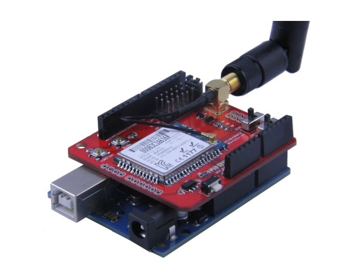
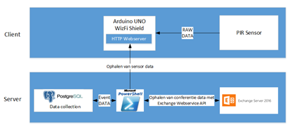

####Arduino UNO met WizFi210 Shield en PIR Sensor

De Arduino UNO is een uitstekende kandidaat voor herhalende taken zoals het verzamelen van sensordata. Deze kleine microcontroller werkt op 5V en heeft als kern een ATmega328P chipset die de functionaliteit aan de microcontroller geeft. Arduino UNO heeft een 16MHz kloksnelheid en een 32kb flashgeheugen dat op de ATmega328P chip zit verwerkt. De Arduino UNO heeft 14 Digitale input/output pinnen waarvan 6 een PWM functionaliteit hebben. Iedere pin kan tot maximaal 20mA stroom aan. Dit is genoeg om de meeste standaardsensoren aan te sturen. Door de eenvoud van deze microcontroller zou dit een uitstekende oplossing kunnen zijn voor het project. De WizFi shield is een gemakkelijk te monteren shield op de Arduino UNO. Dit wifi prototype shield is zo opgebouwd dat deze eenvoudig te monteren is op de Arduino UNO. Zo maakt de WizFishield gebruik van een UART interface. De ESP8266 chipset die de WizFishield geïntegreerd heeft, ondersteunt wifi standaard 802.11 b/g/n en accesspunt modus. Uit de specificatie documentatie was af te leiden dat deze module de nodige WPA2-Enterpise vereisten zou ondersteunen.

In eerste instantie lag de focus op het gebruik van sensors en het aanspreken van de Exchange Server. Hierbij werden Arduino UNO Rev.3 en een Passive Infrared Sensor (PIR) gebruikt om de activiteit in een vergaderzaal te detecteren. De Arduino UNO microcontroller geeft sensordata draadloos door aan een server die een PowerShell script host. Hiervoor maakt de Arduino UNO controller gebruik van een zelfstandige ESP8266 wifimodule. De bedoeling is dat het PowerShell script controleert op de Exchange Server of de vergaderzaal gereserveerd is door de Exchange Web Service API (EWS) aan te spreken. Zo vergelijkt het script de datum en tijd van de reservatie met de ontvangen sensordata. Als het script de eerste 30 minuten van de vergadering of 20 minuten nadat de vergadering is begonnen, geen activiteit detecteert in de vergaderzaal dan zal het script de reservering van de vergadering op de Exchange Server annuleren. Zo kan de vergaderzaal door iemand anders opnieuw geboekt worden. De events die het script onderneemt, zouden worden bijgehouden in een PostgreSql databank. De databank verzamelt informatie over de bezetting en de redenen waarom de reservatie van de vergaderzaal werd geannuleerd. Er wordt gekozen voor apparatuur op batterijen. De architectuur zou er als volgt uitzien:

Het eerste probleem dat zich voordeed bij het testen van het Arduino UNO prototype en de WizFi210 shield, was de verbinding van de Arduino met het wifi netwerk van Digipolis. Deze gebruikt WPA2-Enterprise PEAP-MSSHAPv2 encryptie. De ondersteuning van Enterprise encryptie voor Arduino UNO en de WizFisheild met de ESP8266 chipset bleek echter te beperkt te zijn. Er zou de mogelijkheid bestaan om een nieuwe firmware te installeren maar deze was betalend om de Enterprise security functionaliteit te kunnen gebruiken. Als oplossing voor dit probleem kan een Root Certificaat binair op de Arduino geplaatst worden. Daarenboven blijkt dat Arduino geen betrouwbare CA authenticatie heeft en kwetsbaar is voor “man in the middle attacks”.

Na het voorleggen van deze problemen werden de risico’s voor de beveiliging van het Digipolis netwerk gewogen en te zwaar bevonden door de stagementors van Digipolis Antwerpen. Bijgevolg is het gebruik van een Arduino en PowerShell geschrapt voor dit project. Het gebruik van PowerShell op een apparaat dat kwetsbaar is voor netwerk intrusies en het opslaan van Binaire netwerkcertificaten is een te groot veiligheidsrisico en onaanvaardbaar voor Digipolis. Daarnaast verkiest Digipolis ook een openssource oplossing.  Er zal ook geen gebruik gemaakt worden van apparaten die gevoed worden met batterijen. Bij het gebruik van batterijen moet je de goedkeuring hebben van de veiligheidscommissie. Immers, het integreren van van lithium batterijen in een gebouw is niet geheel zonder gevaar gezien lithium een ontvlambare substantie is en aangegeven moet worden bij de brandweer. Ook het onderhoud van batterijen brengt kosten met zich mee. Om deze redenen zal er voor een testopstelling gekozen worden dat werkt op netstroom. Er wordt besloten om verder op zoek te gaan naar alternatieven waarbij het gebruik van vergaderzalen verder geoptimaliseerd kan worden.
