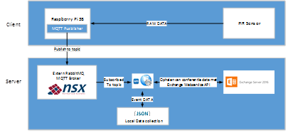

##Design

Uit het voorgaande onderzoek is de volgende architectuur ontstaan die hieronder is geïllustreerd. De rol van NSX Normalized Systems en de configuratie van de Exchange server worden later in de scriptie niet in detail besproken in deze scriptie. NSX is een extern bedrijf waar Digipolis mee samenwerkt en de configuratie om toegang te krijgen tot hun data is voor veiligheidsredenen beperkt beschikbaar is. De privileges tot de Exchange server configuratie vallen buiten de bevoegdheid van de scope van deze scriptie.

