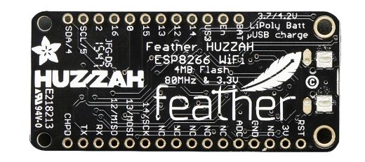

####2.1.1.2	Arduino Featherwing HUZZAH ESP8266

Bij een volgende opstelling werd er gekozen om met een Arduino Featherwing HUZZAH te werken. De Arduino Featherwing HUZZAH is kleiner dan de Arduino UNIO en heeft een geintegreerde ESP8266 chipset. Ook hierbij controleert een script op de Exchange Server of de vergaderzaal gereserveerd is door de Exchange Web Service API (EWS) aan te spreken. Het schema ziet er dan als volgt uit:
 

In tegenstelling tot de eerste testopstelling, werd er niet gewerkt met apparatuur gevoed door batterijen maar met apparaten die hun voeding uit netstroom halen.
 

Zoals eerder bleek, was de verbinding van de Arduino met het wifi netwerk van Digipolis een obstakel. Deze gebruikt WPA2-Enterprise PEAP-MSSHAPv2 encryptie. Een Arduino Uno met externe ESP8266 wifi module, blijkt geen waardig alternatief voor de eerste gefaalde proefopstelling gezien de ondersteuning van Enterprise encryptie voor Arduino eerder beperkt is.
 

Tijdens het overleg bleek dat het niet eenvoudig zou zijn om een goedkeuring te krijgen voor de eigengemaakte voeding (de voeding zou via netstroom verlopen en niet via batterijen zoals in de eerste opstelling). De procedure die gevolgd moet worden is te lang en waarschijnlijk niet haalbaar in deze stageperiode. Bovendien kunnen er geen veiligheidscertificaten voorgelegd worden en ontbreken doeltreffende betrouwbaarheidstesten voor de stepdownconverter die de veiligheidsrisico’s voor Digipolis tot nul moeten reduceren.

Ook deze testopstelling krijgt een no-go. Enerzijds vergt het eigen PCB-design een lange procedure om tot een goedkeuring en een certificiëring te komen die quasi onmogelijk gerealiseerd kan worden binnen de periode van deze stage. Anderzijds blijft de externe ESP8266 wifi module problemen genereren bij het gebruik van Enterpise level encryptie.
 