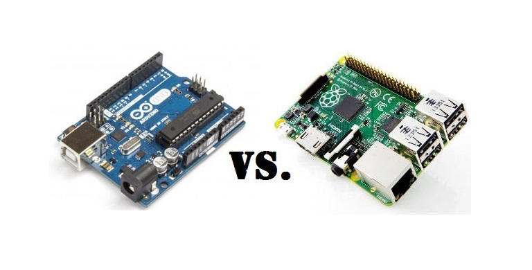

###Hardware

In de eindeloze zee van mogelijkheden bij Internet Of Things gebruikt men meestal de goedkoopste oplossing om een project te realiseren. Om een sensorproject tot zijn recht te laten komen, is een Arduino meestal meer dan voldoende.  Uit onderzoek bleek dat op vlak van beveiliging op enterprise niveau, het open-source-plaatje toch vaak een financiële kost met zich meedraagt en dat bij opensource alternatieven vragen rondom beveiliging rijzen. Bij dit project is er voor gekozen om de veiligheid van data en de evolutie van het project naar de toekomst toe zo flexibel mogelijk te houden waardoor de Raspberry Pi 3B de beste keuze werd. De microcontroler biedt vele potenties zoals de onboard connectiviteit en de gelegenheid om op een volwaardig operating systeem te draaien. Deze vele features zorgen ervoor dat de mogelijkheden en de stabiliteit gegarandeerd is tot op het moment dat men deze verder ontwikkelt.
De Raspberry PI 3B ondersteunt ook veel meer programmeer- en scriptingtalen waardoor zowel op gebied van hardware als software de deur naar de toekomst open staat.
