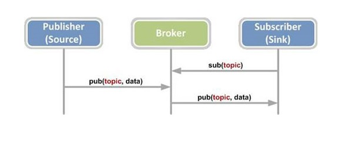
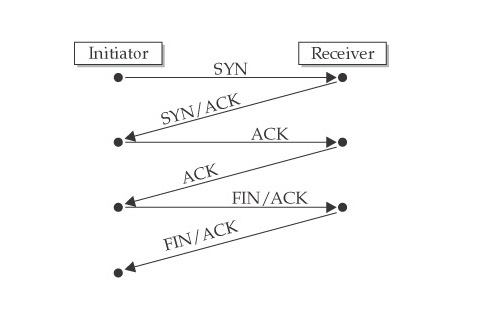

###Interactie

Bij het ontwikkelen van dit project en al de fasen van Arduino UNO tot Raspberry Pi 3B zijn heel wat communicatie mogelijkheden bekeken zoals HTTP servers, Restfull API's en MQTT om er maar enkelen op te noemen. Er is uiteindelijk gekozen voor MQTT omdat dit protocal het meest flexibele was om assynchrone informatie te verzenden. Het HTTP protocol is eerder synchroon en moet de server en client gelijktijdig beschikbaar zijn. Het HTTP ondersteund in zijn pure vorm geen afhandeling offline berichten. MQTT heeft ook de eigenschap om een flexibele Quality of Service (QoS) aan te bieden onafhankelijk van de instellingen van de MQTT Publisher of de Subscriber. De MQTT Broker zal zich naar maten de configuratie van de Broker het toelaat zich schikken naar de configuratie vereisten van de de MQTT Publisher of MQTT Subscriber. De Quality of service bepaald hoe berichten worden afgehandeld. MQTT bied 3 niveaus van Quality of sservice:

* 
QoS 0 is de meest voorkomende methode om berichten te versturen. Deze metode wordt ook wel de "fire and forget"  methode genoemd. De Publisher verstuurt het bericht 1 maal door. Voor het ontvangen van dit bericht wordt geen ontvangstbevestiging gestuurd of duplicaat bijgehouden door de MQTT Broker. De kans dat een bericht aankomt of niet is afhankelijk van de eigenschappen van het onderliggende TCP/IP protocol. In de figuur rechts is een weergavan van een TCP/IP handshake te zien hoe het TCP/IP protocol een verbinding tot data transmissie verzoek van van client naar een server. QoS 0 geeft dus geen enkele garantie dat het bericht is aangekomen.

* 
QoS 1 geeft tot tegenstelling van QoS 0 de garantie dat het bericht op zen minst 1 maal is aangekomen bij de ontvanger. Het is echter wel mogelijk dat er duplicaat berichten verzonden worden. Het bericht wordt bij de verzender opgeslagen tot de Publsiher een PUBACK bericht ontvant gan de MQTT Broker. Een PUBACK bericht is een commando verstuurd van de MQTT Borkern als ontvangstbevestiging. Zolang de Publisher geen PUBACK binnen een bepaalde timeout periode heeft ontvangen zal de publisher het zelfde bericht periodiek blijven versturen.
 
* 
Qos 2 is de meest redundante maar traagste methode van data verzending met het MQTT protocol. Het garandeert dat een bericht maximum 1 maal ontvangen is. Het MQTT protocol doet dit doormiddel van het twee maal te communiceren per bericht tussen MQTT client of MQTT Broker. Bij het Publishen van een bericht stuurt de MQTT Broker een PUBREC bericht naar de MQTT Publisher om te aan te geven dat de MQTT Broker het bericht ontvangen heeft van de MQTT Publisher.  Wetende dat de MQTT Broker het bericht in goede orde heeft ontvangen verwijderd de Publisher het originele bericht en stuurt naar de MQTT Broker een PUBBREL bericht. De MQTT Broker zal het ontvangen MQTT bericht bewaren tot het een PUBCOMP bericht ontvangen heeft van de Subscriber. Dit PUBCOMP bericht indiceert aan de broker dat het bij ontvangen van het PUBCOMP commando, het bericht met zekerheid is aangekomen en mag verwijderen zodat er geen duplicaten ontstaan.
