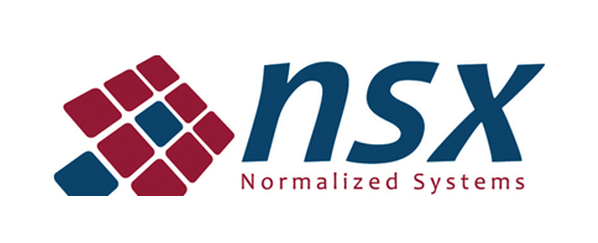
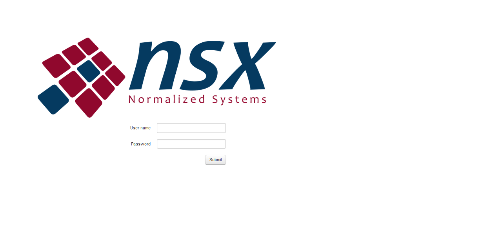

###NSX Normalized systems

NSX Normalized systems is een spin-off van de Universiteit van Antwerpen. dit startersbedrijf vond zijn oorsprong in het departement Economie, Management Information Systems (MIS). De bedoeling van NSX normalized systems is het optimaliseren van software ontwikkeling en architectuur zodat deze naar te toekomst toe makkelijker mee kan evolueren in het snel groeiende digitale tijdperk. NSX richt er zich op dat software is geschreven in een finer construct zodat deze naar de toekomst toe gemakkelijker is uit te bereiden.

Bij Digipolis staat data security voorop. Daarom maakte Digipolis er een punt van dat data intern bleef oen externe Brokers van derden kwamen bij dit project niet van pas. Bij het aanvangen van dit project had Digipolis Antwerpen nog geen MQTT Broker. Daarom heeft Digipolis Antwerpen de keuzen gemaakt deze bij NSX te hosten. NSX koos ervoor om een RabbitMQ Broker op te zetten. De configuratie van de RabbitMQ Broker was niet bekend. Het aanvragen van den nodige configuratie instellingen en het afstemmmen van de MQTT Publisher op de MQTT Broker was een lang process en tot op heden niet successvol.

De Raspberry Pi 3B gebruikt Paho MQTT en Mosquito MQTT libraries package voor Raspbian om data te verzenden naar NSX. De verzamelde PIR data word zo real-time via een WiFi verbinding door naar de NSX RabbitMQ MQTT Broker verzonden met de volgende topic structuur "iot/{deviceType}/{deviceId}/{parameter}". De beveiliging van de server was van dag 1 al geimplementeerd. Dit maakte het moeilijk om het Python3 script op de RabbitMQ Broker af te stemmen. Het was mogelijk om een test account op de server te krijgen zodat er in theorie een message kon gepubliceerd worden. Deze account had echter geen admin privileges, zo was het moeilijk om de configuratie van de Broker te achterhalen of het Python3 script te debuggen. Het bleek echter een blijvend probleem te zijn met als hoofdverdachte de geimplementeerde veiligheidsprotocollen. Zo was het  publishen van een topic op de NSX Broker vanuit de externe Digipolis Antwerpen lokatie met hoge beveiligings restricties tot op heden niet successvol. Bij NSX kon lokaal wel een successvolle publish plaatsvinden.

De onderstaande linker afbeelding geeft het NSX data login portaal weer. Na het inloggen kan de gebruiker de verzonden telemetry van de Raspberry Pi 3B+ raadplegen Dit is weergegeven in onderstaande rechter afbeelding.

De beveiliging liet niet toe om een willekeurig topic te posten om zo rogue data input tegen te gaan. Lokale experimenten op de Raspberry PI 3B van een MQTT postback bericht was wel mogelijk. Dit deet vermoeden dat er toch iets mis liep door de veiligheidsmaatregelen, configuratie instellingen en de miscommunicatie tussen MQTT pusblisher en MQTT Broker bij NSX.
