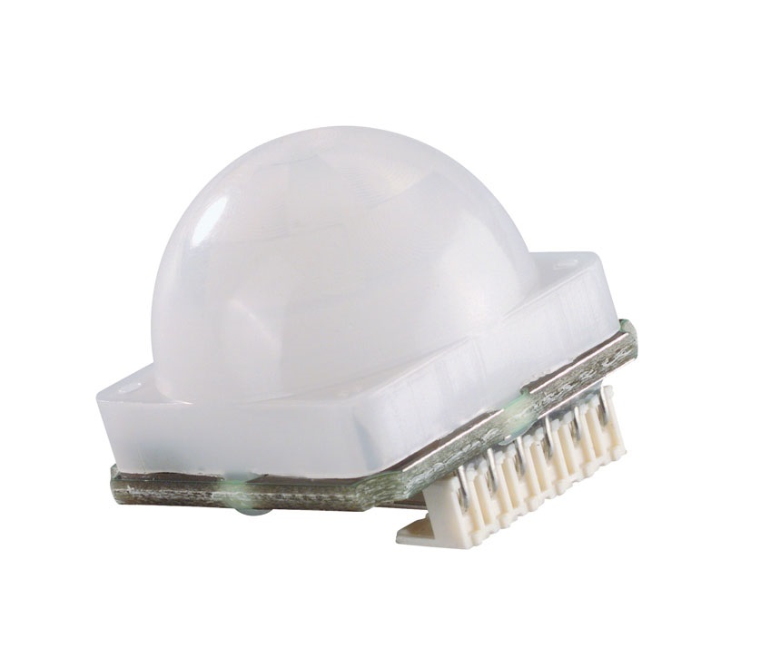

####PIR-STD-LP

Voor de PIR sensor is gezocht naar een flexibele passieve infrarood sensor met een zeer laag verbruik en die opties biedt naar de toekomst toe. Bovendien kan deze sensor enkele handelingen autonoom uitvoeren zonder hulp van een extra microcontroller zoals Arduino of Raspberry Pi. Zo heeft de PIR-STD-LP sensor van B+B een ingebouwde lichtgevoelige weerstand (LDR) waardoor de hoeveelheid licht in een ruimte gemeten kan worden. Een OUT signaal kan een power relay aansturen wat het bijvoorbeeld mogelijk maakt het licht of andere apparatuur in de vergaderzaal in of uit te schakelen waarmee energie bespaard kan worden. Het technische aspect zal later in het design gedeelte van deze scriptie verder besproken worden.
