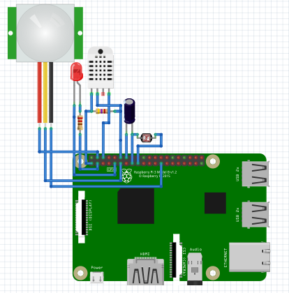
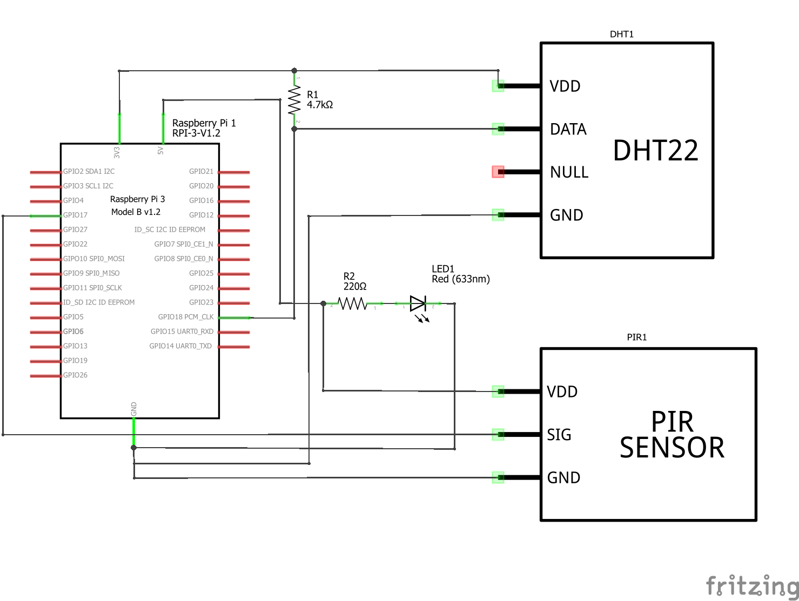
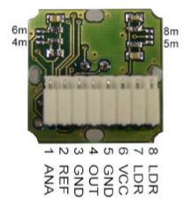

###Raspberry PI 3B en passieve infrarood sensor

Tijdens het onderzoek is er gekeken naar wat het beste besturingssystem is om de Raspberry PI 3B aan te sturen voor dit project. Hiervoor is Raspbian en Windows IoT nader bekeken en getest. De vraag vanuit Digipolis was om een systeem te hebben dat gemakkelijk te onderhouden is en daarenboven gemakkelijk kan worden uitgebreid naarmate het project vordert. De Raspberry PI 3B is een prachtig stukje hardware dat enorm veel mogelijkheden biedt. Als kern heeft de Raspbeerry PI 3B een System on Chip (SoC) Broadcom BCM2837 chipset met een 4xARM Cortex-A53, 1.2GHz CPU. En 1GB LPDDR2(900MHz) RAM geheugen. Naast een standaard 10/100 Ethernet verbinding heeft de Raspberry PI 3B ook een ingebouwde 2.4GHz 802.11n wifi module en een bluetooth 4.1 classic module en een heleboel aansluitmogelijkheden voor audio, video, camera’s en sensoren. Het doel van een Raspberry Pi is ook een beetje om Internet of Things toegankelijk te maken voor iedereen. Zo heeft Raspberry Pi met Raspbian besturingssysteem een basispakket Python en het programma Scratch aan boord. Dit maakt het aansturen van sensoren gemakkelijk door gebruik te maken van een Python code script met de nodige instructies. Deze Scripts zijn gemakkelijk te schrijven in Python en te code achteraf terug te lezen.

Windows IoT .NET Core is een recente speler in het Internet of Things. Omdat dit systeem onderzocht maar niet gebruikt is in het project, wordt deze maar beknopt besproken. De focus bij Windows IoT .NET Core ligt op het gebruik van Microsoft Azure IoT Hub en het gebruik van headless and headed apps die op basis van ASP.NET Core draaien in een minimale Windows Core omgeving. Het is mogelijk om andere programmeertalen te gebruiken in deze omgeving nadat de nodige componenten hiervoor geïnstalleerd zijn op het besturingssysteem. Bij het onderzoek is gebleken dat er hier en daar toch compatibiliteitsproblemen zijn bij het ontwikkelen van apps in Visual Studio als je Python wilt ontwikkelen. De bediening van Windows IoT ASP.NET Core op de Raspberry PI 3B via PowerShell of Putty maakt het gemakkelijk om het besturingssysteem aan te sturen. Het was van belang voor Digipolis dat het sensor gedeelte zo simpel mogelijk bleef, daarom werd besloten om geen volledige nieuwe app te schrijven om het systeem aan te sturen. Voorheen was ook besloten dat er geen PowerShell zou gebruikt worden om netwerkveiligheidsredenen. Om dit project en de nodige compatibiliteitsproblemen zich bleven voordoen, is er gekozen om Windows IoT .NET Core niet te gebruiken.

De Raspberry PI 3B zal aangestuurd worden door Raspbian, een Linux besturingssysteem dat de stabiliteit garandeert voor langlopende projecten en waarvan het gebruiksgemak bewezen is. De sensoren worden gecontroleerd door een Python3 script dat bij het opstarten van de Raspberry PI 3B automatisch data vergaart. Deze data wordt realtime doorgestuurd en bewaard bij de NSX RabbitMQTT Broker. Een webservice API gehost in een Docker omgeving, zal de data ophalen bij NSX middels een MQTT subscription. Door het analyseren van de data en het te vergelijken met de reservaties op de Exchange server, kan er beslist worden of de vergaderzaal effectief in gebruik is. Bij een negatief antwoord kan de vergaderzaal vrijgegeven worden voor een volgende gebruiker. Hierdoor wordt de bezettingsgraad geoptimaliseerd.

Er is geen limitatie op het gebruik van Raspbian waardoor het project uitbreidbaarheid is naar andere zalen. De SD kaartjes met het Raspbian operating systeem zijn gemakkelijk te dupliceren en ook het python script heeft maar een minimum aan configuratie nodig. Hierdoor dient de hostname, credentials en de MQTT per Raspberry PI 3B te worden bijgewerkt. Door de hostname als referentie te gebruiken kan de Raspberry PI 3B op het netwerk terug gevonden worden zonder dat deze beïnvloedt wordt mocht er later een statisch of dynamic IP adress toegewezen worden.

Tijdens het onderzoek met Windows IoT Core zijn er toch enkele problemen aan het licht gekomen. Zo diende er onderzocht te worden wat het meest geschikte besturingssysteem zou zijn voor de Raspberry PI 3B. Al snel bleek dat Windows IoT Core de meeste complicaties met zich mee bracht. Er bleken te veel conflicten voor te doen bij het gebruik van Python scripts. Rasphian bleek een betere keuze gezien conflicten nagenoeg niet voorkomen. Een bijkomend voordeel is dat een Raspbian zeer gebruiksvriendelijk is en quasi letterlijk 'plug and play' bleek nadat de libraries geïmporteerd waren.

Bij de ontwikkeling van een ASP.NET Core webservice API in de Docker met een Windows 10 Home besturingssysteem bleek dat een Windows 10 Pro versie een absolute noodzaak is. Voor de Windows 10 Home-versie is er een Docker "legacy" Toolbox met Docker engine 1.12 beschikbaar. Echter deze ondersteunt enkel ASP.NET projecten en niet de laatste ASP.NET Core. Docker for Windows met Docker engine 1.13 of hoger, ondersteund ASP.NET Core. Het was voor dit Digipolis-project van fundamenteel belang dat ASP.NET Core gebruikt werd. Docker vereist Hyper-V en container ondersteuning die alleen in Windows 10 Pro beschikbaar is. Hiervoor was het aankopen van een Windows 10 Pro upgrade nodig.

Als basis voor de webservice API is er gebruikt gemaakt van een code template die door Digipolis is voorzien. Deze code template draagt de naam Eventhandler en is gebaseerd op een ASP.NET Core applicatie. Tijdens het testen van de Digipolis EventHandler ASP.NET Core template moest deze ook gemigreerd worden naar een nieuwe versie van Visual Studio. Het project zit nu in het stadium van integratie en ontwikkeling van de webservice API en het bouwen van de MQTT-brug tussen de Raspberry PI 3B en de webservice tamplate voor een feilloze overdracht van data. De volgende stap is het ophalen van de gegevens bij de exchange server en deze te vergelijken met de door NSX verzamelde gegevens.

Tijdens het testen is het moeilijk om de verzonden data naar NSX te verifiëren zonder toegang te hebben tot het NSX analytisch portaal. Een test-account is aangevraagd. In de huidige situatie moet bij iedere test NSX gecontacteerd worden per e-mail of telefonisch om de resultaten van de test te controleren. Dit is niet progressief en een tijdrovend proces. Voor dit project heeft het lang geduurd voordat de toestemming gekregen was om python te mogen gebruiken. De interne resources die Digipolis heeft om python op te volgen en te beheren zijn eerder beperkt. Gezien dat na het bekijken van opties zoals IoT Azure, was dit ook geen mogelijkheid omdat data lokaal dient te blijven en het gebruik van IoT Azure uitgesloten.

De PIR sensor heeft een openhoek van horizontaal +/-50° en een verticale hoek van +/-30° en kan werken op zowel 3.3V als 5V. De sensor heeft een sensor bereik van 12 meter dat kan in 4 stappen ingekort worden door een reeks soldeerpunten op de achterkant van het apparaat stapsgewijs met elkaar te verbinden. Op die manier kan de PIR sensor ingesteld worden op 4, 5, 6, 8 of 12 meter. Bij de prototypes zal het maximale bereik van de PIR sensor benut worden omdat het nog niet bekend is in welke actuele vergader ruimte deze zal getest worden.

De bandbreedte van het signaal werkt van 0.5Hz tot 25Hz. In rust stand geeft het signaal een stroom van 40µA, bij het detecteren van activiteit loopt het signaal op tot 400µA. Omdat de sensor een kleine dimensie heeft van 25x25x20mm kan deze later gemakkelijk in een behuizing worden weggewerkt. De DHT22 en de extra features van de PIR sensor zijn wel opgenomen in de documentatie en schema's maar niet geimplementeerd in de hardware. Zo kan is er een basis beschikbaar om deze in de practijk te implementeren naar maten het project evolueert. Het breadboard en elektrisch scheme zien er dus als volgt uit:

Dit is het technische schema van de interne werking van de B+B PIR-STD-LP sensor:

De PIR sensor zal als volgt worden aangesloten op de raspberry Pi 3B:

* De Analoog out (ANA) pin van de PIR sensor word verbonden met de GPIO17 pin van de Raspberry 3B. Deze ppin zal de data uitlezen die de pirsensor teruggeeft wanneer iet gedetecteerd word.
* De REF pin van de PIR wordt aangesloten op de 5V pin van de Raspberry Pi 3B, dit is optioneel maar helpt valse positieve detecties voorkomen.
* De twee ground (GND) pinnen van de PIR worden verbonden met de GND pinnen van de Rapberry Pi 3B.
* De OUT pin van de PIR sensor blijft onverbonden, deze kan echter gebruikt worden om een relay aan te sturen zodat in de toekomst verlichting of andere electronica automatisch kan aan of uitgeschakeld worden. 
* De Vcc van de PIR sensor word verbonden met een 5V output pin van de Raspberry Pi 3B. Deze pin voorziet de pirsensor van stroom om te kunnen functioneren.
* De twee LDR pinnen op de PIR zijn de twee uiteinden van een lichtgevoelige weerstand. Hiermee kan op basis een analoge waarde van 0 tot 1023  de lichtsterkte in een ruimte gemeten worden. De LDR staat los van het geheel van de interne werking van de PIR sensor en is optioneel te gebruiken.

Het Pythong 3 script voor de Raspberry Pi 3B bestaat uit enkele segmenten. Het eerste segment leest de data uit van de PIR sensor en zet deze om naar een waarde 1 of 0. Deze waarde zal dan door gebruik te maken het MQTT protocol naar een RabbitMQ MQTT Broker bij NSX gestuurd worden.

