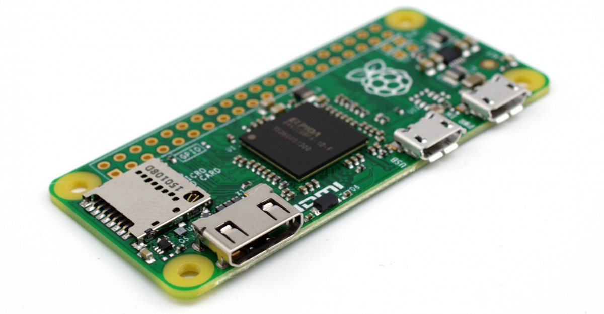
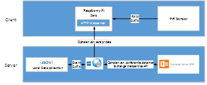

####Raspberry Pi Zero

Gezien de eerste fase problemen gaf in verband met de garanties die de netwerkbeveiliging van Digipolis Antwerpen vereisen, kwam een volgende fase in zicht waarbij de inzet van meer intelligente hardware getest kan worden. Hiervoor komt de Raspberry Pi Zero en de Raspberry Pi 3B in aanmerking. Het opstellen van een volwaardige test-setup van de Raspberry Pi Zero zou extra kosten met zich meebrengen. De Raspberry Pi Zero heeft geen interne wifi module wat de aankoop van een wifi shield en extra onderdelen nodig om een prototype te bouwen zou vereisen. Een alternatief zou de Rarspberry Pi Zero W kunnen zijn, maar gezien de hardware voor het project al besteld was en de late release date van 28 februari 2017, komt deze niet meer in aanmerking. Ook de aankoop van losse onderdelen voor de Raspberry Pi Zero zou het project danig vertraging kunnen bezorgen gezien de aankoopprocedures de Wet op de Overheidsopdrachten moeten volgen.

Het gebruik van Raspberry Pi Zero zou extra aankopen met zich meebrengen. Dit brengt de haalbaarheid in het gedrang gezien de aankoopprocedures het project kunnen vertragen gezien de Wet op de Overheidsopdrachten gevolgd moet worden. Bovendien heeft de Raspberry Pi Zero geen meerwaarde in vergelijking met een volwaardige Raspberry Pi 3B.
Er is geen testhardware beschikbaar gezien de Raspberry Pi Zero, WiFi shield en extra onderdelen zoals pins, usb kabel converter zouden moeten worden aangekocht. De prijs van dit alles komt overeen met een volwaardige Raspberry Pi 3B die hiermee in zicht komt als alternatief voor de Raspberry Pi Zero.

De Raspberry Pi Zero blijkt te duur en het samenstellen te complex voor de noden die er leven. Digipolis heeft post stage geen interne elektronica techniekers ter beschikking om de hardware samen te stellen of te debuggen. De Raspberry Pi Zero W zal later in de scriptie nog besproken worden als kandidaat. Er wordt gekeken naar een Raspberry Pi 3B als alternatief voor de Raspberry Pi Zero. 
