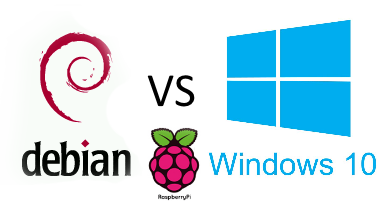

###Software

Voor Digiplis was het essentieel dat dit project zo autonoom mogelijk kon werken. Daarom is het belangrijk dat zowel de hardware en software stabiel zijn en met een minimum aan onderhoud kunnen functioneren. Tijdens deze scriptie is zowel Windows IoT Core en Linux Raspbian nader bekeken als kanshebbers voor dit project.

Naast het kiezen van het besturingsysteem was het ook van belang een goede manier te vinden om de sensor data te verzamelen. Hiervoor is gekeken naar   PowerShell, Java, ASP.NET Core, Python3, NodeRED,enzovoort. Het aanspreken van sensor data is in dit geval eenvoudig, daarom viel de keuze op Python3. Python is een heel functionele, stabiele maar toch ook simpele programmeertaal. Het is mogelijk om onder meer websites, webservers, scripts te schrijven met deze taal. De code in de vorm van een Python script is achteraf zeer leesbaar en kan vanuit een basistekst editor geschreven of gelezen worden.

Bij het testen van beide besturingsystemen is gekeken of deze over de nodige flexibileit en ondersteuning beschikten. In dit onderzoek is gebleken dat Windows IoT Core toch de voorkeur wegdraagt. Ten eerste omdat de nodige software hiervoor geïnstalleerd is en daarnaast het eerder gericht is tot het gebruik van de Azure IoT als backbone. Bij het ontwikkelen van Python3 voor Windows IoT Core kwamen redelijk wat complicaties naar boven bij de onderlinge compatibliteit van .NET Core packages. Digipolis Antwerpen wenst alle data lokaal te houden en een zo simpel mogelijk systeem met de minste onderhoudsnoden te voorzien.

In tegenstelling tot Windows IoT .NET Core is de Raspberry Pi 3B en het besturingsysteem Raspbian afgestemd op Python3, zonder dat er extra pakketten moeten geïnstalleerd worden. Voor de extra functionaliteit zoals het MQTT protocal kunnen er pakketten zoals Paho of Mosquito geinstalleerd worden om een project van MQTT communicatie te voorzien. Raspbian heeft ook voorgeïnstalleerde ondersteuning voor de GPIO pinnen van de Raspberry Pi 3B. Deze ondersteuning zorgt ervoor dat sensoren met veel gebruiksgemak aan de Raspberry Pi gekoppeld kunnen worden. Raspbian is een Linux systeem dat gebaseerd is op Debian en heeft al jaren een reputatie als stabiel operating systeem voor servers die onvermoeibaar hun diensten aan gebruikers aanbieden. Dit maakt de Raspbian tot ideale kandidaat besturingssysteem voor dit project.
