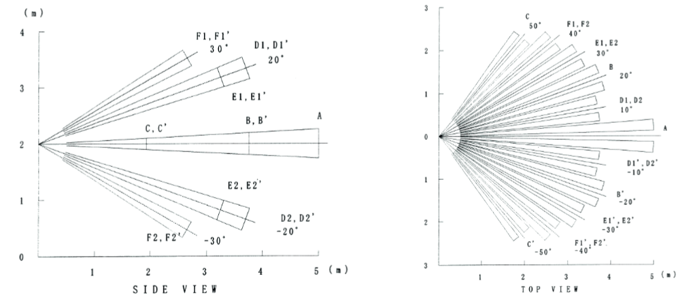
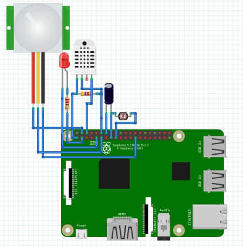
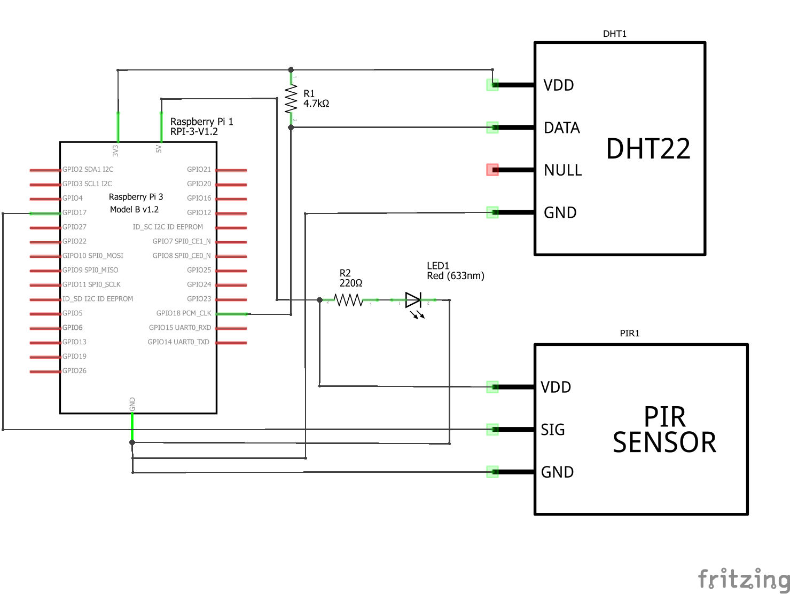
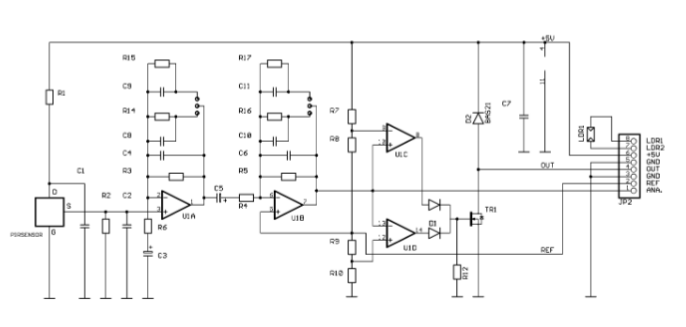
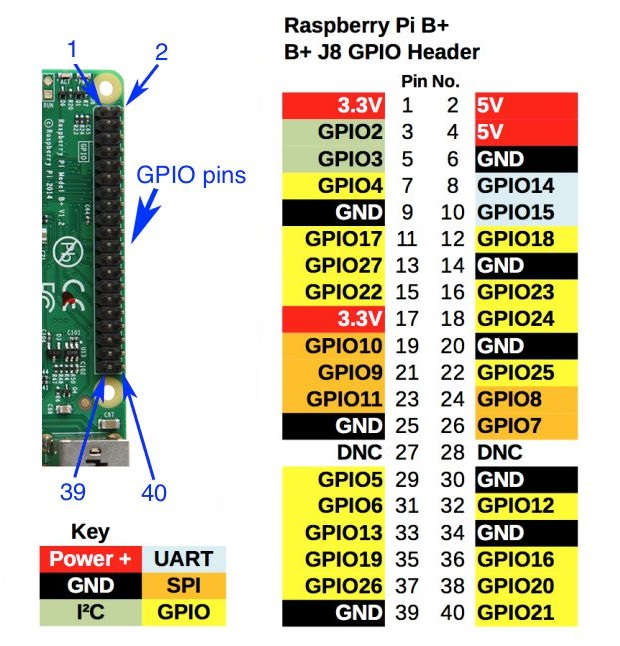
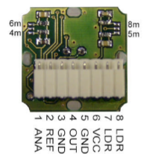
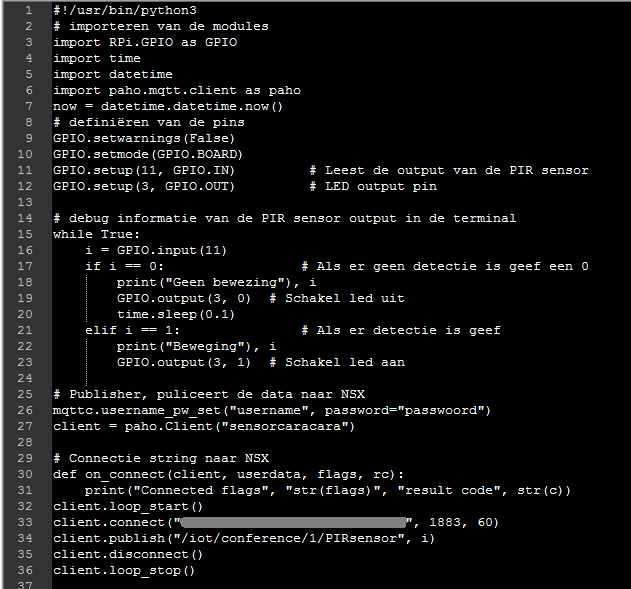

###Raspberry Pi 3B en PIR

Tijdens het onderzoek in dit project is er gekeken naar wat het beste besturingssystem is om de Raspberry Pi 3B aan te sturen. Hiervoor is Raspbian en Windows IoT nader bekeken en getest. De wens van Digipolis was om een systeem te hebben dat gemakkelijk te onderhouden is en eenvoudig kan worden uitgebreid naarmate het project vordert. De Raspberry Pi 3B is een prachtig stukje hardware dat heel veel mogelijkheden biedt. Als kern heeft de Raspbeerry Pi 3B een System on Chip (SoC) Broadcom BCM2837 chipset met een 4xARM Cortex-A53, 1.2GHz CPU en 1GB LPDDR2(900MHz) RAM geheugen. Naast een standaard 10/100 Ethernet verbinding heeft de Raspberry Pi 3B ook een ingebouwde 2.4GHz 802.11n wifi module en een bluetooth 4.1 classic module met daarnaast een aantal aansluitmogelijkheden voor audio, video, camera’s en sensoren. Raspberry Pi maakt Internet of Things zowaar toegankelijk voor iedereen. Zo heeft Raspberry Pi met Raspbian besturingssysteem, een basispakket Python en het programma Scratch aan boord. Dit maakt het aansturen van sensoren gemakkelijk en wel door gebruik te maken van een Python code script met de nodige instructies. Deze scripts zijn gemakkelijk te schrijven in Python en te code is achteraf terug te lezen.

Windows IoT .NET Core is een recente speler in het Internet of Things gebeuren. Omdat dit systeem wel onderzocht maar niet gebruikt werd in het project, wordt deze maar beknopt besproken. De focus bij Windows IoT .NET Core ligt op het gebruik van Microsoft Azure IoT Hub en het gebruik van headless and headed apps die op basis van ASP.NET Core vormen in een minimale Windows Core omgeving. Het is mogelijk om andere programmeertalen te gebruiken in deze omgeving nadat de nodige componenten hiervoor geïnstalleerd zijn op het besturingssysteem. Bij het onderzoek is gebleken dat er hier en daar toch compatibiliteitsproblemen zijn bij het ontwikkelen van apps in Visual Studio als je Python wilt ontwikkelen. De bediening van Windows IoT ASP.NET Core op de Raspberry Pi 3B via PowerShell of Putty maakt het gemakkelijk om het besturingssysteem aan te sturen. Het was van belang voor Digipolis dat het sensor gedeelte zo simpel mogelijk bleef, daarom werd besloten om geen volledig nieuwe app te schrijven om het systeem aan te sturen. Voorheen was ook besloten dat er geen PowerShell gebruikt zou worden om netwerkveiligheidsredenen. Gezien er zich compatibiliteitsproblemen bleven voordoen, is er gekozen om Windows IoT .NET Core niet te gebruiken in dit project.

De Raspberry Pi 3B zal aangestuurd worden door Raspbian, een Linux besturingssysteem dat de stabiliteit garandeert voor langlopende projecten en waarvan het gebruiksgemak bewezen is. De sensoren worden gecontroleerd door een Python 3 script dat bij het opstarten van de Raspberry Pi 3B automatisch data vergaart. Deze data wordt realtime doorgestuurd naar de NSX RabbitMQTT Broker. Een Web Service API, gehost in een Docker omgeving, zal de data ophalen bij NSX middels een MQTT subscription. Door het analyseren van de data en het te vergelijken met de reservaties op de Exchange Server, kan er gekeken worden of de vergaderzaal effectief in gebruik is. Bij een negatief antwoord kan de vergaderzaal vrijgegeven worden voor een volgende gebruiker. Hierdoor wordt de bezettingsgraad geoptimaliseerd.

Er is geen limitatie op het gebruik van Raspbian waardoor het project uitbreidbaarheid is naar andere zalen. De SD kaartjes met het Raspbian operating systeem zijn gemakkelijk te dupliceren. Ook het Python script heeft maar een minimum aan configuratie nodig. Hiervoor dient de hostname, credentials en de MQTT per Raspberry Pi 3B te worden bijgewerkt. Door de hostname als referentie te gebruiken kan de Raspberry Pi 3B op het netwerk teruggevonden worden zonder dat deze beïnvloed wordt mocht er later een statisch of dynamic IP adress toegewezen worden.

Tijdens het onderzoek met Windows IoT Core zijn er toch enkele problemen aan het licht gekomen. Zo diende er onderzocht te worden wat het meest geschikte besturingssysteem zou zijn voor de Raspberry Pi 3B. Al snel bleek dat Windows IoT Core de meeste complicaties met zich meebracht. Er bleken te veel conflicten voor te doen bij het gebruik van Python scripts. Rasphian bleek een betere keuze gezien conflicten nagenoeg niet voorkomen. Een bijkomend voordeel is dat een Raspbian zeer gebruiksvriendelijk is en quasi letterlijk 'plug and play' bleek nadat de libraries geïmporteerd waren.

Bij de ontwikkeling van een ASP.NET Core Web Service API in de Docker met een Windows 10 Home besturingssysteem bleek dat een Windows 10 Pro versie een absolute noodzaak is. Voor de Windows 10 Home versie is er een Docker "legacy" Toolbox met Docker engine 1.12 beschikbaar. Echter deze ondersteunt enkel ASP.NET projecten en niet de laatste ASP.NET Core. Docker for Windows met Docker engine 1.13 of hoger, ondersteunt ASP.NET Core. Het was voor dit Digipolis project van fundamenteel belang dat ASP.NET Core gebruikt werd. Docker vereist Hyper-V en container ondersteuning die alleen in Windows 10 Pro beschikbaar is. Hiervoor was het aankopen van een Windows 10 Pro upgrade nodig.

Als basis voor de Web Service API is er gebruik gemaakt van een code template die door Digipolis is voorzien. Deze code template draagt de naam Eventhandler en is gebaseerd op een ASP.NET Core applicatie. Tijdens het testen van de Digipolis EventHandler ASP.NET Core template moest deze ook gemigreerd worden naar een nieuwe versie van Visual Studio. Het project zit nu in het stadium van integratie en ontwikkeling van de Web Service API en het bouwen van de MQTT-brug tussen de Raspberry Pi 3B en de webservice tamplate voor een feilloze overdracht van data. De volgende stap is het ophalen van de gegevens bij de Exchange Server en deze te vergelijken met de door NSX verzamelde gegevens.

Tijdens het testen is gebleken dat het het moeilijk is om de data verzonden naar NSX te verifiëren zonder toegang te hebben tot het NSX analytisch portaal. Een test-account is aangevraagd. In de huidige situatie moet bij iedere test NSX gecontacteerd worden per e-mail of telefoon om de resultaten van de test te controleren. Dit is niet progressief en een tijdrovend proces. Voor dit project heeft het lang geduurd eer de toestemming verkregen werd om Python te mogen gebruiken. De interne resources die Digipolis heeft om Python op te volgen en te beheren zijn eerder beperkt. Na het bekijken van opties zoals IoT Azure, was ook dit geen mogelijkheid omdat data lokaal dient te blijven en dus is het gebruik van IoT Azure uitgesloten.

De PIR sensor heeft een open hoek van horizontaal +/-50° en een verticale hoek van +/-30° en kan werken op zowel 3.3V als 5V. De sensor heeft een bereik van 12 meter wat in 4 stappen ingekort kan worden door een reeks soldeerpunten op de achterkant van het apparaat stapsgewijs met elkaar te verbinden. Op die manier kan de PIR sensor ingesteld worden op 4, 5, 6, 8 of 12 meter. Bij de prototypes zal het maximale bereik van de PIR sensor benut worden omdat het nog niet bekend is in welke actuele vergaderruimte deze getest zal worden.

De bandbreedte van het signaal werkt van 0.5Hz tot 25Hz. In ruststand geeft het signaal een stroom van 40µA. Bij het detecteren van activiteit loopt het signaal op tot 400µA. Omdat de sensor een kleine dimensie heeft van 25x25x20mm kan deze later gemakkelijk in een behuizing worden weggewerkt. De DHT22 en de extra features van de PIR sensor zijn wel opgenomen in de documentatie en schema's maar niet geïmplementeerd in de hardware. Zo kan is er een basis beschikbaar om deze in de practijk te implementeren naarmate het project evolueert. Het breadboard en elektrisch schema zien er als volgt uit:

Dit is het technische schema van de interne werking van de B+B PIR-STD-LP sensor:

De PIR sensor zal als volgt worden aangesloten op de raspberry Pi 3B:

* De Analoog out (ANA) pin van de PIR sensor wordt verbonden met de GPIO17 pin van de Raspberry Pi 3B. Deze ppin zal de data uitlezen die de PIR sensor teruggeeft wanneer iet gedetecteerd word.
* De REF pin van de PIR sensor wordt aangesloten op de 5V pin van de Raspberry Pi 3B, dit is optioneel maar helpt valse positieve detecties voorkomen.
* De twee ground (GND) pinnen van de PIR sensor worden verbonden met de GND pinnen van de Rapberry Pi 3B.
* De OUT pin van de PIR sensor blijft onverbonden, deze kan echter gebruikt worden om een relay aan te sturen zodat in de toekomst verlichting of andere electronica automatisch kan aan of uitgeschakeld worden. 
* De Vcc van de PIR sensor wordt verbonden met een 5V output pin van de Raspberry Pi 3B. Deze pin voorziet de PIR sensor van stroom om te kunnen functioneren.
* De twee LDR pinnen op de PIR sensor zijn de twee uiteinden van een lichtgevoelige weerstand. Hiermee kan op basis een analoge waarde van 0 tot 1023 de lichtsterkte in een ruimte gemeten worden. De LDR staat los van het geheel van de interne werking van de PIR sensor en is optioneel te gebruiken.

Het Python 3 script voor de Raspberry Pi 3B bestaat uit enkele segmenten. Het eerste segment leest de data uit van de PIR sensor en zet deze om naar een waarde 1 of 0. Deze waarde zal dan door gebruik te maken van het MQTT protocol naar een RabbitMQ MQTT Broker bij NSX gestuurd worden.

De door het Python3 script verzameld data wordt op zijn beurt doorverzonden naar het databeheer van NSX Normalized Systems. Dit gebeurt door gebruik te maken van Messaging Queuing Telemetry Transport Protocol (MQTT). MQTT is een opensource Machine to Machine (M2M) protocol (ISO/IEC PRF20922) dat werd ontwikkelt in 1999 en veel gebruikt wordt bij Internet of Things. Dit protocol bevind zich in de applicatie laag en zorgt ervoor dat apparaten gemakkelijk asynchroon berichten met elkaar kunnen uitwisselen via het TCP/IP protocol. De grootste voordelen aan MQTT is dat dit protocol gammakelijk te gebruiken is, energie besparend en een lage overhead heeft. Het MQTT protocol  gebruik het publish en subscribe paradigm. Publishers en subscribers moeten niet tegelijk verbonden zijn om berichten te kunnen ontvangen. MQTT maakt gebruik van een MQTT Broker. Dit is het hart van het systeem. Een MQTT Broker is een service dat de geschiedenis van verzonden berichten bijhoud en deze naar die subscribers (clients) verzend wanneer deze beschikbaar zijn. Berichten worden verzonden of ontvangen op basis van eeen topic. Een topic is een string van data die hoofdlettergevoelig is zo een unieke waarde voorstelt. Bij MQTT is hoeven de publishers en subscribers geen directe verbindingen met elkaar te hebben of gelijktijdig online zijn. Dit maakt MQTT een zeer flexibel protocol dat gemakkelijk is uit te bereiden naar de toekomst toe. Dit wordt mogelijk gemaakt omwillen van de MQTT broker die als bemiddelaar de last op zicht neemt om nieuwe berichten te ontvangen en door te sturen naar de client wanneer deze beschikbaar is.
