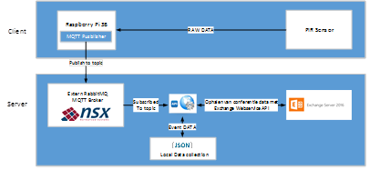

####Raspberry Pi 3B

De Raspberry Pi 3B geeft het project meer mogelijkheden. Zo kan er gekozen worden voor een Linux of Windows IoT .NET Core besturingssysteem. De netwerkbeveiligingsstandaard is ook veel beter omdat de Raspberry Pi 3B een volwaardig besturingssysteem heeft. De Raspberry Pi 3B heeft zowel een draadloze wifi als een wired Ethernet verbinding. Verder kunnen er ook meer intelligente sensors aangesproken worden zoals camera's en displays. Zo zou een camera bijvoorbeeld gebruikt kunnen worden om de zitplaatsbezetting op te volgen in de vergaderzaal. Een interactief display zou de boeking van de zaal kunnen weergeven en gebruikers de mogelijkheid geven om een vergaderzaal op locatie te boeken voor een toekomstige vergadering. Digipolis is gebonden aan een strenge wetgeving en privacy beleid. Daarom is het gebruik van een camera in dit project niet van toepassing.

Voor het project worden er twee identieke prototypes gebouwd. Een eerste prototype is gebaseerd op een Rasberry Pi 3B die aan het 220V stroomnetwerk wordt gekoppeld. Op de Raspberry Pi 3B wordt een Python script gehost die de sensordata van de Passive Infrared Sensor (PIR) verzamelt. Het besturingssysteem van de Raspberry Pi 3B staat nog niet vast. De verzamelde data wordt via Message Queueing Telemetry Transport (MQTT) gepubliceerd en naar de lokale netwerk server die een Web service API in een Docker omgeving host. De Raspberry Pi 3B is de MQTT Publisher die de sensordata verzameld. Vervolgens ontvangt de MQTT Broker op de server de sensor telemetrie data. De Web Service API vergelijkt de ontvangen sensor data van de MQTT Broker met de reservering op Exchange Server. Als een vergaderzaal gereserveerd is, kan deze terug vrijgegeven worden na het vergelijken van de data wanneer er gedurende een bepaalde periode geen activiteit waargenomen werd.

Ook hier wordt er gebruik gemaakt van dezelfde condities als die voorheen voor het PowerShell script werden bepaald. De ontvangen activiteitdata wordt vergeleken met de datum en tijd van de reservering. Zo weet de Web Service API of er iemand in de vergaderzaal zit. Als in het begin van een reservering of na een periode wanneer de vergadering begonnen is, er geen activiteit plaatsvindt, dan kan de Web Service API de reservering annuleren. Zo kan de beschikbaarheid van de vergaderzalen optimaal benut worden. Het NSX platform verwerkt de ruwe sensordata enerzijds tot realtime leesbare data voor de API, anderzijds zorgt het NSX platform voor het opslaan van de sensordata in .JSON op het datalake van iOT platform van Digipolis.

De sensoren kunnen aangevuld worden met andere meettoestellen of toepassingen. Tijdens de onderzoeksfase bleek dat het integreren van een microfoon voor het detecteren van geluid geen optie zou zijn. Enerzijds is de wetgeving op de privacy een beperkende factor. Anderzijds levert het slechts een beperkte winst op in de functionaliteit. Gezien de microfoon enkel gebruikt wordt om geluid te detecteren in de ruimte, zou het dezelfde functie opnemen als de PIR sensor (deze detecteert eveneens de aanwezigheid van objecten), wat geen meerwaarde levert aan het project. De PIR sensor heeft voorrang op de microfoon gezien deze nagenoeg geen invloed heeft op de Privacywetgeving. Het initiële prototype zal zich richten tot het implementeren van enkel een PIR sensor maar zal wel de DHT22 sensor in de documentatie opnemen om de verdere evolutie van het project te ondersteunen na de stage.
