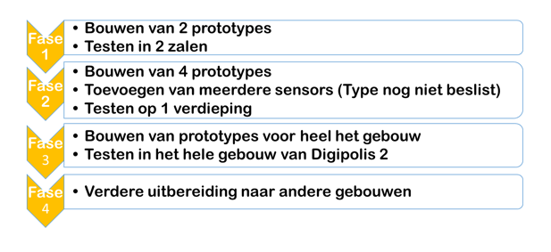

###De toekomst van het project

De integriteit van het project zal eerst grondig getoetst worden in de drie fasen:  development, acceptatie en productie. Als Het project door development, acceptatie en later in productie geplaatst wordt zal het project eerst een periode proeflopen. Voor dit project zijn twee prototypes gebouwd die later in 2 zalen gestest worden. Bij een positeif resultaat van het testen in de vergaderzalen kunnen er extra sensoren aan het ontwerp worden toegevoegd. Het project is gemakkelijk uit te bereiden door meer prototypes te bouwen. Onderstaande figuur geeft het stappenplan weer van de verdere ontwikkeling van het project:

